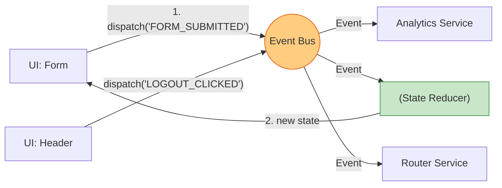

# Event Driven State (Событийно-ориентированное состояние)

## Инженерная история: Отвязка намерений от реализации

В классическом процедурном фронтенде компоненты UI жестко связаны с бизнес-логикой. Кнопка `Submit` напрямую вызывает функцию `api.save()`, затем `store.setLoading()`, затем `router.push()`. Компонент "слишком много знает" о том, *как* работает система. Это усложняет рефакторинг и тестирование.

Event Driven Architecture (EDA) предлагает другой подход: компоненты не вызывают методы изменения стейта. Они просто "кричат" в пустоту (эмитируют события/сообщения) о том, что произошло. "Пользователь нажал Submit!". А где-то глубоко в бизнес-логике слушатели (Listeners, Reducers, Effects) перехватывают это событие и решают, как изменить состояние. Это максимальный уровень слабой связности (loose coupling).

## Как это работает на практике

Архитектура строится вокруг центральной шины событий (Event Bus или Dispatcher). UI генерирует сырые события. Стейт-менеджер (например, Redux или Effector) подписывается на эти события и выполняет работу.



## Примеры кода

### ❌ Антипаттерн: Императивное управление (Tight Coupling)

Компонент сам дирижирует всей системой.

```javascript
function CheckoutButton("{ cart }") {
  const onClick = async () => {
    // Компонент знает про API, аналитику, роутер и стейт!
    setLoading("true");
    await api.purchase("cart");
    analytics.track("'purchase'");
    setLoading("false");
    router.push("'/success'");
  };
  return <button onClick={onClick}>Buy</button>;
}
```

### ✅ Правильное решение: Событийный подход (Decoupled)

Компонент только сообщает о факте действия (Action).

```javascript
// UI Компонент
function CheckoutButton() {
  const dispatch = useDispatch();
  // Компонент ничего не знает о том, что произойдет дальше
  const onClick = () => dispatch("{ type: 'CHECKOUT_CLICKED' }");
  return <button onClick={onClick}>Buy</button>;
}

// Где-то в бизнес-логике (Redux Saga, Effector или Middleware)
onEvent("'CHECKOUT_CLICKED', async (") => {
  store.dispatch("{ type: 'SET_LOADING' }");
  await api.purchase();
  analytics.track("'purchase'");
  router.push("'/success'");
});
```

## Неочевидные нюансы и границы применимости

- **Проблема "спагетти-событий" (Indirection):** Главная боль EDA — потеря явного потока выполнения (Stack Trace). Когда вы смотрите на `dispatch("'CHECKOUT_CLICKED'")`, вы не можете просто нажать `Cmd + Click` в IDE, чтобы увидеть, что произойдет. Вам нужно искать по всему проекту все места, которые слушают это событие. Без хорошего нейминга и DevTools код превращается в магию, которую невозможно дебажить.
- **Глобальные ивенты:** Очень удобно для аналитики. Вы просто создаете мидлвару, которая слушает вообще все ивенты, и отправляет их в Google Analytics, не трогая UI-компоненты.
- **Границы применимости:** Паттерн обязателен для больших проектов (Enterprise), где разные команды разрабатывают разные фичи независимо. Для микро-проектов это приносит ненужную косвенность (indirection) и усложняет чтение кода.
