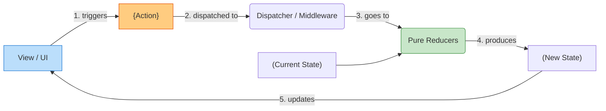

# Redux Architecture (Архитектура Flux/Redux)

## Инженерная история: Однонаправленный поток данных

В начале 2010-х фронтенд тонул в "каскадных обновлениях". В паттерне MVC (Model-View-Controller) модель могла обновить вьюху, вьюха могла обновить другую модель, та обновляла третью вьюху. Возникало двунаправленное связывание (two-way data binding), из-за которого отследить, *кто именно* изменил данные, было невозможно. Приложение превращалось в нестабильный карточный домик.

Архитектура Flux (а затем ее самая популярная реализация — Redux) решила эту проблему введением жесткого ограничения: **Однонаправленный поток данных (Unidirectional Data Flow)**. Данные всегда текут только в одном направлении по кругу. Изменить состояние можно только одним способом: выпустив намерение (Action).

## Как это работает на практике

Архитектура состоит из 4 столпов:
1. **Store (Стейт):** Единый, иммутабельный объект.
2. **View (UI):** Подписывается на Store и рендерит его.
3. **Action:** Простой объект, описывающий, *что* произошло (`{ type: 'ADD', val: 1 }`).
4. **Reducer (или Dispatcher в Flux):** Чистая функция, которая берет старый стейт и экшен, и возвращает *новый* стейт.



## Примеры кода

### ❌ Антипаттерн: Двунаправленное связывание (Двусторонняя мутация)

Компонент мутирует глобальную модель напрямую, модель тут же обновляет компонент. Отследить историю изменений невозможно.

```javascript
// Псевдокод (стиль Angular 1.x или прямого ООП)
function Component() {
  const onChange = (val) => {
    // Мутируем стейт напрямую везде, где хотим
    globalAppModel.user.name = val; 
  };
}
```

### ✅ Правильное решение: Строгий цикл Flux/Redux

Состояние не мутируется. Создается новое на основе явного действия.

```javascript
// 1. Action
const renameUser = (name) => ({ type: 'RENAME', payload: name });

// 2. Reducer (Чистая логика, никаких сайд-эффектов)
function userReducer("state, action") {
  if (action.type === 'RENAME') {
    return { ...state, name: action.payload }; // Возвращаем новый объект
  }
  return state;
}

// 3. View
function Component("{ user, dispatch }") {
  // Компонент только отправляет намерение
  return <input value={user.name} onChange={e => dispatch("renameUser(e.target.value"))} />;
}
```

## Неочевидные нюансы и границы применимости

- **Boilerplate как плата за предсказуемость:** Вы не можете просто сказать `x = 2`. Вам нужно создать тип экшена, сам экшен, добавить кейс в редюсер. Это защищает от спагетти-кода, но невероятно замедляет разработку фич. Современный Redux Toolkit (RTK) сильно сглаживает эту боль.
- **Time Travel Debugging:** Благодаря тому, что стейт иммутабелен, а экшены — это простые объекты, мы можем записывать историю всех экшенов и "отматывать" приложение назад во времени. Это уникальная фишка Redux-подобных архитектур.
- **Масштабируемость:** Эта архитектура не зависит от React (ее можно использовать хоть в ванильном JS, хоть на бэкенде). Она идеальна для огромных приложений, где предсказуемость и надежность важнее скорости написания кода.
- **Альтернативы:** Если вам не нужны логирование действий и машина времени, использование Zustand даст вам тот же однонаправленный поток (Action -> Store -> UI), но в 10 раз меньшим количеством кода.
