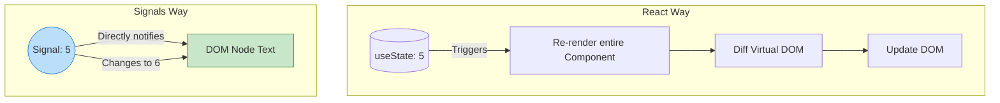

# Signals (Сигналы)

## Инженерная история: Реактивность с хирургической точностью

React построен на концепции: "если состояние изменилось, давай перерендерим весь компонент (сверху вниз), построим новый Virtual DOM, сравним его со старым и обновим реальный DOM там, где есть разница". Это работает хорошо, пока компонентов не становятся тысячи. Тогда начинаются проблемы с перфомансом, и разработчики обмазываются `useMemo` и `React.memo`.

**Signals (Сигналы)** — это паттерн мелкогранулярной реактивности (fine-grained reactivity), популяризованный библиотеками SolidJS, Preact и Vue (в виде Refs). Сигнал — это просто обертка вокруг значения, которая точно знает, *какие именно DOM-узлы* зависят от этого значения. Когда значение сигнала меняется, он обновляет **только конкретный текстовый узел или атрибут в DOM**, вообще минуя процесс рендера компонента и Virtual DOM.

## Как это работает на практике

Вы создаете сигнал. Компонент рендерится *ровно один раз* за весь жизненный цикл. При чтении значения сигнала внутри JSX, сигнал подписывает на себя этот конкретный кусок DOM.



## Примеры кода

### ❌ Антипаттерн: Классический React (Лишняя работа)

При каждом вводе символа в инпут, React заново вызывает функцию `HeavyForm` и пересоздает весь ее контекст.

```javascript
function HeavyForm() {
  const [text, setText] = useState('');
  
  // Компонент перерендерится полностью при каждом нажатии клавиши
  return (
    <div>
      <input value={text} onChange={e => setText(e.target.value)} />
      <HeavyTable /> {/* Нужно оборачивать в React.memo, иначе будет тормозить */}
    </div>
  );
}
```

### ✅ Правильное решение: Сигналы (SolidJS / Preact)

Функция вызывается один раз. Обновляется только сам инпут.

```javascript
import { signal } from "@preact/signals-react";

// Сигнал можно объявить даже вне компонента!
const text = signal('');

function HeavyForm() {
  // Этот console.log вызовется только 1 раз при монтировании
  console.log("Component rendered"); 

  return (
    <div>
      <input 
        value={text.value} 
        onChange={e => text.value = e.target.value} 
      />
      <p>Текст: {text}</p> {/* Обновится хирургически точно */}
      <HeavyTable /> {/* Никогда не перерендерится лишний раз */}
    </div>
  );
}
```

## Неочевидные нюансы и границы применимости

- **Конфликт с идеологией React:** Сигналы в React (через `@preact/signals-react`) работают как "хак". Они вмешиваются во внутренности React, чтобы пропустить фазу рендера. Это может конфликтовать с Concurrent Mode и Suspense, которые полагаются на чистые функции и VDOM.
- **Отсутствие зависимости от хуков:** Сигналы можно использовать вне компонентов (в обычных JS/TS файлах). Они не подчиняются правилам хуков React (Rule of Hooks), что дает огромную свободу в архитектуре.
- **Производительность:** На огромных таблицах, графиках или анимациях (где стейт меняется 60 раз в секунду), Сигналы уничтожают React по производительности.
- **Будущее:** Сигналы стали новым стандартом реактивности. Их уже внедрили Vue, Angular, Svelte (Runes), Solid. React сопротивляется этому подходу, предлагая в ответ React Compiler (автоматическую мемоизацию под капотом).
