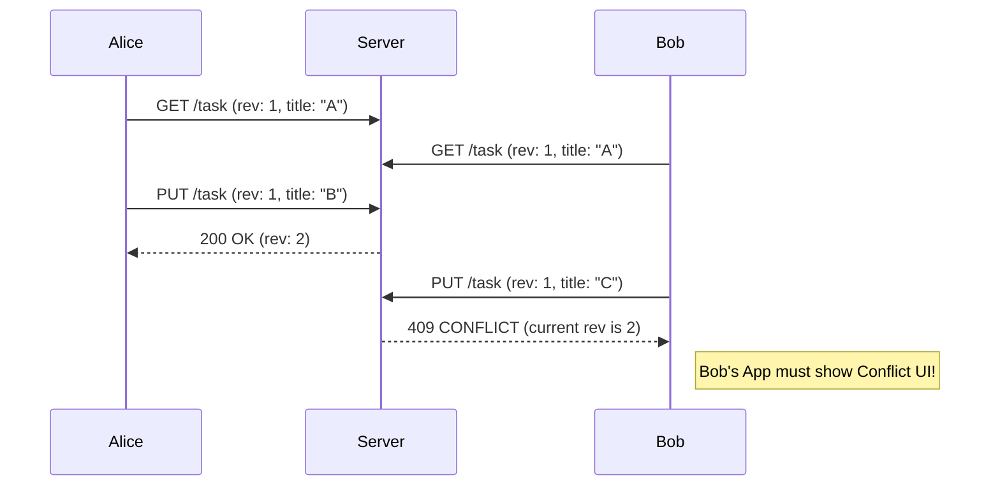

# Conflict Resolution (Разрешение конфликтов)

## Инженерная история: Столкновение реальностей

Представьте, что вы разрабатываете Trello. Алиса и Боб открыли одну и ту же карточку задачи. Алиса меняет название задачи на "Сделать бэкенд", а Боб в ту же секунду меняет название на "Написать API". Оба нажимают "Сохранить". Чья версия должна остаться? Если сервер просто принимает последний пришедший запрос, работа одного из пользователей будет молча уничтожена.

**Conflict Resolution (Разрешение конфликтов)** — это стратегия того, как система должна вести себя при одновременном (конкурентном) изменении одних и тех же данных. На фронтенде эта проблема особенно обостряется при реализации Offline-First: когда пользователь был в метро, редактировал данные локально, а при появлении сети клиент попытался синхронизировать сильно устаревшую ветку реальности с сервером.

## Как это работает на практике

Есть три базовых стратегии разрешения:
1. **LWW (Last Write Wins):** Побеждает тот, чей timestamp сохранения (или номер версии) больше. Простая, но теряет данные проигравшего.
2. **Manual (Ручное):** Как в Git. Сервер возвращает ошибку 409 Conflict, и фронтенд показывает UI: "Ваша версия конфликтует с версией сервера, выберите, что сохранить". Безопасно, но бесит пользователя.
3. **Merge (Слияние):** Автоматическое слияние непересекающихся полей (Алиса изменила title, Боб изменил description — сохраняем оба).



## Примеры кода

### ❌ Антипаттерн: Слепая перезапись (Blind Overwrite)

Фронтенд отправляет полный объект без указания того, на какой версии он базировался. Сервер всё перезаписывает. Данные Боба уничтожают работу Алисы.

```javascript
// Плохо: Нет версионирования
async function saveTask(taskId, newTitle) {
  await fetch(`/tasks/${taskId}`, {
    method: 'PUT',
    body: JSON.stringify({ title: newTitle }) // Сервер не знает, от какой версии мы отталкиваемся
  });
}
```

### ✅ Правильное решение: Оптимистичные блокировки (ETag / Versioning)

Мы передаем текущую версию данных. Если на сервере версия уже другая, мы получаем ошибку и запускаем процесс разрешения конфликта.

```javascript
async function saveTaskSafe(task) {
  const response = await fetch(`/tasks/${task.id}`, {
    method: 'PUT',
    headers: {
      'If-Match': task.eTag, // Или передаем версию в теле: version: task.version
    },
    body: JSON.stringify(task)
  });

  if (response.status === 412 || response.status === 409) {
    const serverTask = await response.json();
    showConflictModal(task, serverTask); // Предлагаем пользователю выбрать
  }
}
```

## Неочевидные нюансы и границы применимости

- **Разрешение на клиенте vs сервере:** Часто сервер берет ответственность за LWW, просто игнорируя старые запросы. Но если нужно умное слияние (например, объединение двух массивов тегов), это логичнее делать на сервере или использовать CRDT на клиенте.
- **Влияние на UX:** Показ окна "Конфликт версий" — это крайняя мера. Для пользователя это стресс ("я что-то сломал"). В современных приложениях (Figma, Notion) пользователи ожидают автоматического слияния, которое достигается через паттерны CRDT или Operational Transformation (OT).
- **Границы применимости:** Базовое версионирование (ETag) обязательно для любых B2B-систем (CRM, ERP), где над одной формой могут работать два менеджера. Для личных туду-листов — LWW (кто последний нажал, тот и прав) вполне достаточно.
