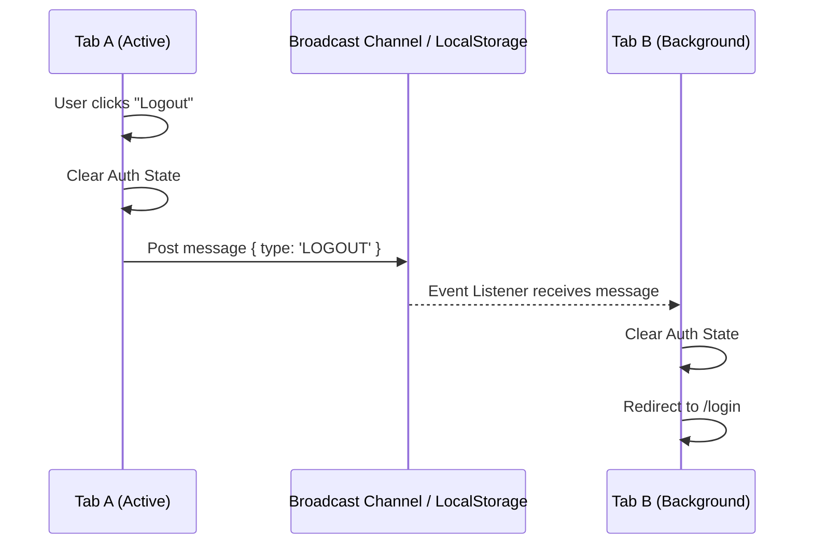

# Cross Tab Synchronization (Синхронизация между вкладками)

## Инженерная история: Призрак устаревших вкладок

Пользователь открывает ваш интернет-магазин в двух вкладках браузера (Tab A и Tab B). В Tab A он нажимает "Добавить товар в корзину", и иконка корзины показывает "1". Но если он перейдет в Tab B, иконка корзины по-прежнему будет показывать "0". Еще хуже: в Tab A пользователь нажимает "Выйти" (Logout) и сессия уничтожается. Если он попытается сделать приватное действие в Tab B, приложение скрашится с 401 ошибкой, так как Tab B "не знает", что авторизации больше нет.

**Cross Tab Synchronization** — это архитектурный паттерн, обеспечивающий мгновенный обмен сообщениями и синхронизацию состояния между всеми вкладками браузера, открытыми на одном домене (Origin).

## Как это работает на практике

Есть два основных механизма:
1. **LocalStorage Events:** Если записать данные в `localStorage`, все *остальные* вкладки этого же домена получат событие `storage`.
2. **BroadcastChannel API:** Современный и более чистый API, позволяющий вкладкам явно подписываться на канал и отправлять туда любые сообщения (даже не сохраняя их в диск).



## Примеры кода

### ❌ Антипаттерн: Игнорирование других вкладок

Вкладки живут в изоляции, полагаясь только на свой in-memory стейт (Redux/React State).

```javascript
function logout() {
  // Очищаем токен, но другие вкладки об этом не узнают до перезагрузки страницы
  localStorage.removeItem('token');
  setGlobalUser(null); 
  router.push('/login');
}
```

### ✅ Правильное решение: BroadcastChannel API

Используем нативный API для общения между вкладками.

```javascript
// Инициализируем канал (в обеих вкладках)
const authChannel = new BroadcastChannel('auth_sync');

// Слушаем сообщения из других вкладок
useEffect(() => {
  const onMessage = (event) => {
    if (event.data.type === 'LOGOUT') {
      setGlobalUser(null); // Синхронизируем стейт
      router.push('/login'); // Выгоняем пользователя
    }
  };
  authChannel.addEventListener('message', onMessage);
  return () => authChannel.removeEventListener('message', onMessage);
}, []);

// Отправляем сообщение при активном действии
function logout() {
  localStorage.removeItem('token');
  setGlobalUser(null);
  authChannel.postMessage({ type: 'LOGOUT' }); // Уведомляем соседей
  router.push('/login');
}
```

## Неочевидные нюансы и границы применимости

- **Слепые зоны LocalStorage:** Если использовать событие `window.addEventListener('storage')`, важно помнить: оно **не** срабатывает в той вкладке, которая инициировала запись в `localStorage`. Оно стреляет только в "соседях".
- **Инструменты из коробки:** Многие библиотеки управления состоянием уже умеют это делать. Например, плагины для Vuex, Redux (`redux-state-sync`) или Zustand могут автоматически транслировать все экшены в другие вкладки, сохраняя стейт на 100% идентичным везде.
- **Двойные сетевые запросы:** Если Tab A делает авторизацию и запрашивает данные пользователя, трансляция стейта избавит Tab B от необходимости делать те же самые запросы.
- **Границы применимости:** Обязательно для состояния аутентификации (Logout/Login), критически важно для корзин электронной коммерции и мультивкладочных дашбордов. Не нужно для эфемерного состояния UI (открытые менюшки, прокрутка).
