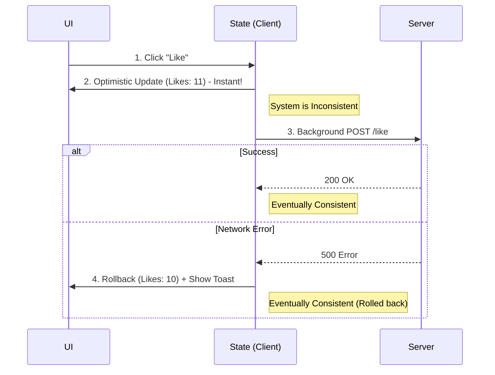

# Eventual Consistency (Согласованность в конечном счете)

## Инженерная история: Иллюзия мгновенности

В классических транзакционных базах данных правит бал концепция ACID: если транзакция прошла, все пользователи гарантированно увидят новые данные (строгая согласованность). Но в масштабах распределенных систем (или интернета, где фронтенд — это удаленный узел, а пинг до сервера может быть 300 мс) строгая согласованность означает, что интерфейс будет "зависать" при каждом клике, ожидая подтверждения от сервера.

**Eventual Consistency (Согласованность в конечном счете)** — это архитектурный компромисс: мы гарантируем, что *если новых изменений не будет, то в конце концов все узлы системы (фронтенды, базы данных) придут к одному и тому же состоянию*. На фронтенде этот паттерн дает жизнь **Оптимистичным обновлениям (Optimistic Updates)**: мы позволяем UI немедленно отобразить новое состояние, предполагая, что сервер в конечном счете его примет.

## Как это работает на практике

Пользователь ставит лайк посту. Вместо того чтобы показать спиннер на кнопке и ждать секунду ответа сервера, мы мгновенно прибавляем `+1` к счетчику лайков. В этот момент стейт клиента и стейт сервера *рассинхронизированы* (не согласованы). Но в фоне идет запрос. Как только сервер отвечает `200 OK`, система снова становится консистентной. Если сервер отвечает ошибкой — мы делаем откат (rollback) к предыдущему состоянию.



## Примеры кода

### ❌ Антипаттерн: Пессимистичное ожидание (Pessimistic Update)

Интерфейс "тормозит" из-за сети. Пользователь чувствует, что приложение медленное.

```javascript
async function toggleLike(postId) {
  setLoading(true); // Блокируем кнопку спиннером
  try {
    const newLikesCount = await api.post(`/likes/${postId}`);
    setLikes(newLikesCount); // Обновляем UI только после сервера
  } finally {
    setLoading(false);
  }
}
```

### ✅ Правильное решение: Оптимистичное обновление (React Query)

Оптимистично меняем данные в кэше. При ошибке восстанавливаем старые данные из бэкапа.

```javascript
const mutation = useMutation({
  mutationFn: toggleLikeOnServer,
  // Вызывается СРАЗУ при мутации
  onMutate: async (newPostId) => {
    await queryClient.cancelQueries(['posts', newPostId]); // Отменяем старые геты
    
    const previousPost = queryClient.getQueryData(['posts', newPostId]);
    // 1. ОПТИМИСТИЧНО обновляем кэш! UI реагирует мгновенно.
    queryClient.setQueryData(['posts', newPostId], old => ({ ...old, likes: old.likes + 1 }));
    
    // Возвращаем контекст для отката
    return { previousPost };
  },
  // Если ошибка, восстанавливаем из бэкапа
  onError: (err, newPostId, context) => {
    queryClient.setQueryData(['posts', newPostId], context.previousPost);
    toast.error("Не удалось поставить лайк");
  },
  // В конце концов перезапрашиваем свежие данные для гарантии
  onSettled: (newPostId) => {
    queryClient.invalidateQueries(['posts', newPostId]);
  }
});
```

## Неочевидные нюансы и границы применимости

- **Сложность откатов:** Оптимистичные обновления легко делать для счетчиков (лайки) или статусов (сделано/не сделано). Но невероятно сложно делать для создания новых сущностей. Если вы оптимистично создали комментарий, какой `id` ему дать? Ведь сервер еще не вернул настоящий `id` из базы. Обычно используют временные UUID, которые потом подменяются на реальные.
- **Психология пользователя:** Откат состояния (Like пропал через секунду) выглядит как магия или баг. Обязательно нужно показывать уведомление (Toast) с объяснением, почему произошел откат.
- **Границы применимости:** Eventual Consistency и Optimistic Updates — золотой стандарт для Consumer-приложений (социальные сети, мессенджеры, плееры). Но для финансовых систем (перевод денег) они неприменимы: лучше показать спиннер на 5 секунд, чем сказать "Деньги переведены!", а потом откатить транзакцию с ошибкой.
