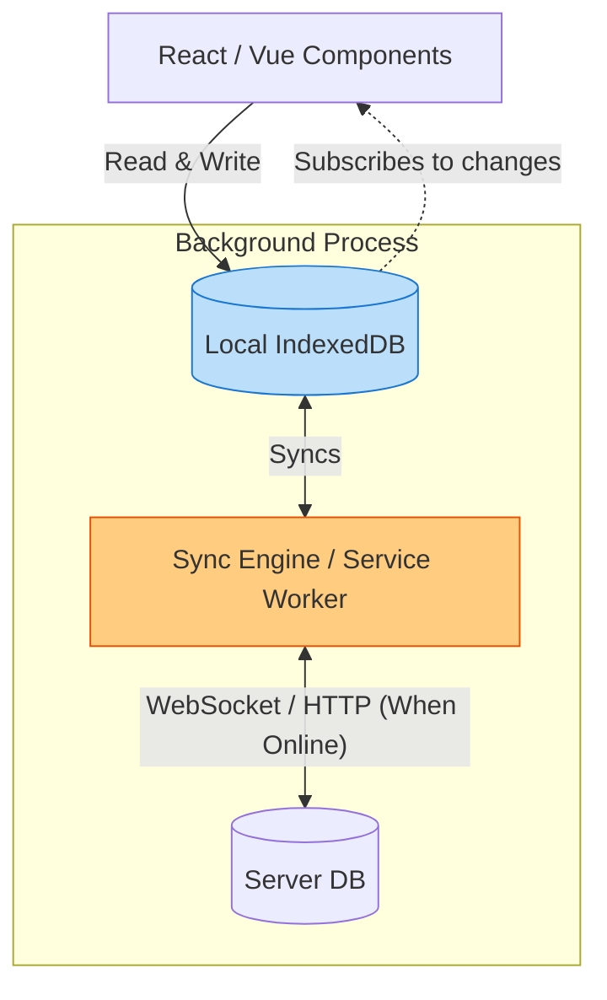

# Offline First

## Инженерная история: Локальная база данных как главный источник истины

Исторически веб-приложения строятся по принципу "Online First": браузер — это просто глупый терминал, который рисует то, что скажет сервер. Если интернет пропадает (пользователь зашел в лифт или едет в метро), приложение превращается в бесполезного динозаврика или вечный спиннер. 

**Offline First** переворачивает эту парадигму с ног на голову. Первичным (и самым надежным) источником истины становится *устройство пользователя*. Приложение всегда читает данные из локальной базы данных (IndexedDB) и пишет в нее же. Это дает мгновенный отклик в 0 мс. А синхронизация с сервером происходит где-то в фоне, когда появляется сеть (Background Sync), совершенно незаметно для пользователя.

## Как это работает на практике

Архитектура требует надежного локального хранилища (обычно IndexedDB, обернутая в RxDB, Dexie или WatermelonDB) и Service Worker'а для перехвата запросов.



## Примеры кода

### ❌ Антипаттерн: Жёсткая зависимость от сети

Если `fetch` падает, приложение ломается и пользователь теряет введенные данные формы.

```javascript
async function saveNote(text) {
  try {
    await fetch('/api/notes', { method: 'POST', body: text });
    alert('Сохранено!');
  } catch (error) {
    // Интернет пропал. Данные потеряны навсегда.
    alert('Ошибка сети! Попробуйте позже.'); 
  }
}
```

### ✅ Правильное решение: Локальная запись (Псевдокод с Dexie)

Мы всегда сохраняем локально. Синхронизация — это отдельный фоновый процесс.

```javascript
import db from './localDb'; // Настроенный Dexie

async function saveNote(text) {
  // 1. Сохраняем в локальную базу. UI обновится мгновенно.
  await db.notes.add({ text, synced: false, id: uuid() });
  
  // 2. Пытаемся запустить синхронизацию (если есть сеть)
  triggerBackgroundSync();
}

// Где-то в Service Worker или фоновом скрипте:
async function triggerBackgroundSync() {
  if (!navigator.onLine) return; // Ждем появления сети
  
  const unsyncedNotes = await db.notes.where('synced').equals(false).toArray();
  for (const note of unsyncedNotes) {
    await fetch('/api/notes', { method: 'POST', body: note.text });
    await db.notes.update(note.id, { synced: true });
  }
}
```

## Неочевидные нюансы и границы применимости

- **Конфликты реальностей:** Если пользователь отредактировал документ оффлайн на телефоне и ноутбуке, при появлении интернета сервер получит две разные версии реальности. Offline First *обязывает* вас реализовывать сложные алгоритмы разрешения конфликтов (CRDT или ручной merge).
- **Безопасность и Квоты:** Браузер может в любой момент удалить данные из IndexedDB (Eviction), если на диске пользователя заканчивается место (если не запросить Persistent Storage). Кроме того, локальные данные легко прочитать, если ноутбук украдут (нужно шифрование).
- **Сфера применения:** Критически важно для PWA (Progressive Web Apps), блокнотов (Notion, Obsidian), таск-трекеров (Linear) и полевых CRM-систем (для курьеров в зонах без связи). Избыточно для обычных интернет-магазинов или блогов.
