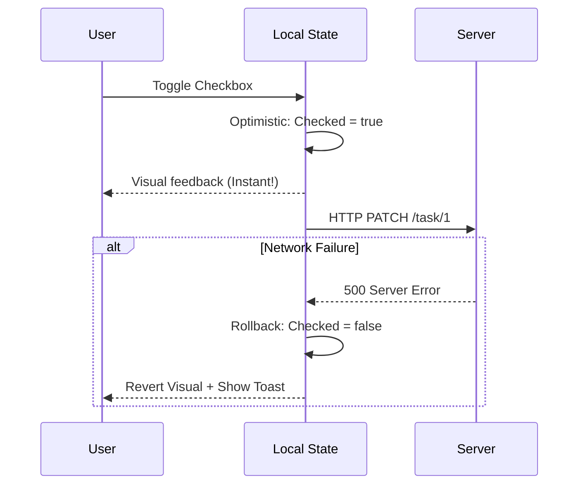

# Optimistic Updates (Оптимистичные обновления)

## Инженерная история: Магия нулевой задержки

Когда пользователь нажимает кнопку "Лайк" в Twitter или "Выполнено" в Todoist, система не показывает ему крутящийся спиннер. Иконка мгновенно окрашивается в нужный цвет. Разработчики знают, что сетевой запрос может занимать от 50 до 1000 миллисекунд. Заставлять пользователя ждать секунду после каждого клика — значит убить ощущение отзывчивости интерфейса (Perceived Performance).

**Оптимистичное обновление** — это UX/UI паттерн, при котором клиентское приложение *оптимистично верит*, что серверный запрос завершится успешно, и немедленно отрисовывает финальное состояние интерфейса. Только в случае (редкой) ошибки приложение извиняется и "откатывает" UI к предыдущему состоянию.

## Как это работает на практике

Реализация состоит из 3 шагов:
1. Сохранить текущее состояние (бэкап).
2. Принудительно (оптимистично) изменить UI стейт.
3. Отправить запрос. Если 200 OK — ничего не делать (или перезапросить свежие данные). Если ошибка 500 — восстановить стейт из бэкапа.



## Примеры кода

### ❌ Антипаттерн: Жизнь в ожидании

Интерфейс выглядит "тяжелым" и медленным.

```javascript
function TodoItem({ task }) {
  const [loading, setLoading] = useState(false);

  const toggle = async () => {
    setLoading(true); // Пользователь видит спиннер
    await fetch(`/tasks/${task.id}`, { method: 'PATCH' });
    setLoading(false); // Пользователь видит галочку
  };

  return <Checkbox checked={task.done} disabled={loading} onChange={toggle} />;
}
```

### ✅ Правильное решение: Оптимистичный UI с откатом (на ванильном React)

Мгновенная реакция с подстраховкой на случай провала.

```javascript
function TodoItem({ initialTask }) {
  // Локальное эфемерное состояние для оптимистичного UI
  const [isDone, setIsDone] = useState(initialTask.done);

  const toggle = async () => {
    const previousState = isDone;
    setIsDone(!isDone); // 1. Оптимистичное обновление мгновенно!

    try {
      const res = await fetch(`/tasks/${initialTask.id}`, { 
        method: 'PATCH', 
        body: JSON.stringify({ done: !isDone }) 
      });
      if (!res.ok) throw new Error('Failed');
    } catch (error) {
      // 2. Откат при ошибке
      setIsDone(previousState);
      alert('Не удалось обновить задачу. Проверьте интернет.');
    }
  };

  return <Checkbox checked={isDone} onChange={toggle} />;
}
```

## Неочевидные нюансы и границы применимости

- **Конкурентные мутации:** Если пользователь нажмет кнопку 5 раз очень быстро, вы можете отправить 5 запросов. Если третий завершится с ошибкой (и вызовет rollback), а пятый с успехом, какой стейт должен остаться? Современные библиотеки вроде TanStack Query (React Query) решают эту боль, автоматически отменяя предыдущие пересекающиеся запросы (`queryClient.cancelQueries`).
- **Сложность ID при создании:** Если оптимистично создается новая сущность (например, карточка в Trello), ей нужен временный `id` (например `uuid()`), чтобы отрендериться в списке. Когда сервер вернет реальный `id` из базы данных, фронтенду придется аккуратно подменить временный ID на настоящий.
- **Когда НЕ использовать:** Ни в коем случае не используйте оптимистичные обновления для финансовых транзакций (покупка), деструктивных действий (удаление проекта) или изменения прав доступа. Ошибка в этих случаях и последующий "откат" вызовут у пользователя панику и потерю доверия к системе. Здесь применяются только **Пессимистичные обновления**.
