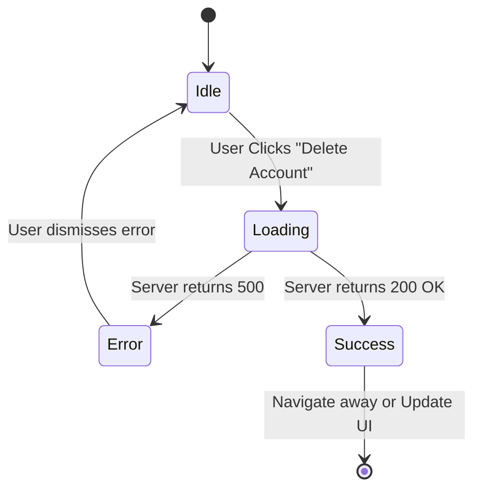

# Pessimistic Updates (Пессимистичные обновления)

## Инженерная история: Честность важнее скорости

При оптимистичных обновлениях мы "времем" пользователю во благо UX, показывая успех до того, как сервер его подтвердит. Но есть ситуации, когда ложь неприемлема. Представьте: вы нажимаете "Перевести $1000", баланс мгновенно уменьшается, появляется надпись "Перевод успешен!". Вы закрываете вкладку. А через секунду в фоне происходит сетевая ошибка. Деньги не переведены, но вы об этом даже не узнали.

**Пессимистичное обновление** — это классический, консервативный подход. Мы исходим из худшего (пессимистичного) сценария: сеть ненадежна, сервер может упасть, данные могут быть невалидными. Поэтому мы строго блокируем UI, отправляем запрос, и обновляем данные на экране *только после того*, как сервер ответит HTTP 200 OK.

## Как это работает на практике

Пользователь инициирует действие -> Кнопка (или вся форма) переходит в заблокированное состояние (disabled + spinner) -> Ожидание сети -> Если успех: обновление UI. Если ошибка: снятие блокировки и показ ошибки.



## Примеры кода

### ❌ Антипаттерн: Оптимистичное удаление критичных данных

Удаление проекта исчезает из UI мгновенно. Если сервер вернет 500, проект "воскреснет" из ниоткуда, напугав пользователя.

```javascript
// ПЛОХО для критичных действий
const deleteProject = async (id) => {
  setProjects(projects.filter(p => p.id !== id)); // Скрыли сразу!
  try {
    await api.delete(`/projects/${id}`);
  } catch (e) {
    // Внезапное воскрешение проекта. Пользователь в шоке.
    setProjects(old => [...old, deletedProject]); 
  }
};
```

### ✅ Правильное решение: Пессимистичная блокировка

Ждем гарантий от сервера.

```javascript
function DeleteProjectButton({ projectId, onDeleted }) {
  const [isDeleting, setIsDeleting] = useState(false);

  const handleDelete = async () => {
    // 1. Блокируем UI
    setIsDeleting(true); 
    try {
      // 2. Ждем ответа сервера
      await api.delete(`/projects/${projectId}`);
      // 3. Только после гарантии успеха обновляем UI/Стейт
      onDeleted(projectId);
    } catch (error) {
      alert("Не удалось удалить проект. Возможно, у вас нет прав.");
    } finally {
      // Снимаем блокировку, если произошла ошибка
      setIsDeleting(false); 
    }
  };

  return (
    <button disabled={isDeleting} onClick={handleDelete}>
      {isDeleting ? 'Удаление...' : 'Удалить проект навсегда'}
    </button>
  );
}
```

## Неочевидные нюансы и границы применимости

- **Двойные клики:** Пессимистичные обновления обязаны сопровождаться блокировкой кнопки (атрибут `disabled`). Иначе нетерпеливый пользователь кликнет "Купить" пять раз, пока крутится спиннер, и с него спишут деньги пять раз.
- **Ощущение тормозов:** Если применять пессимистичный подход ко всем действиям (лайкам, чекбоксам, добавлению в корзину), приложение будет казаться "тяжелым", медленным и лагучим.
- **Границы применимости:** Пессимизм обязателен в следующих сценариях:
  - Финансовые транзакции (оплата, переводы).
  - Деструктивные действия (Удалить аккаунт, Удалить базу данных).
  - Действия, успех которых зависит от сложной серверной валидации или прав доступа (изменение роли пользователя на Admin).
  - Выход из системы (Logout) — мы должны убедиться, что сервер инвалидировал токен.
