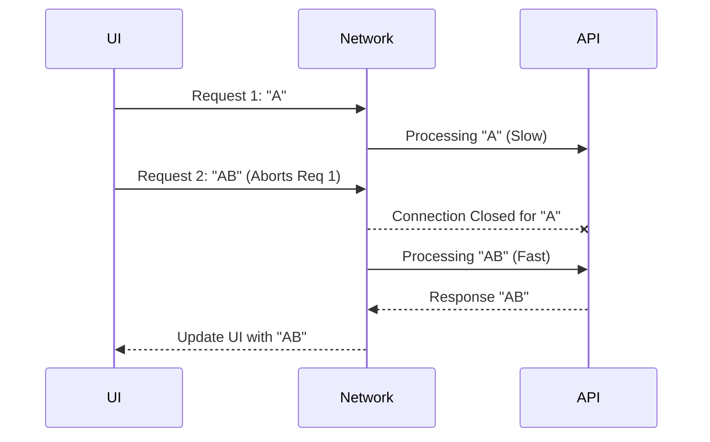

# Race Conditions (Состояние гонки)

## Инженерная история: Кто пришел последним, тот и прав? Нет.

Представьте живой поиск (Autocomplete). Пользователь быстро вводит "A", затем "B". 
1. Посылается запрос `GET /search?q=A`
2. Посылается запрос `GET /search?q=AB`

Сеть непредсказуема. Сервер может долго искать "AB", но быстро ответить на "A". В результате браузер сначала получает ответ для "AB" и рисует его. А через долю секунды приходит задержавшийся ответ "A" и перезаписывает результаты! На экране в инпуте написано "AB", а результаты поиска показаны для буквы "A". 

Это классический баг **Race Condition (Состояние гонки)**. Проблема возникает из-за асинхронной природы интернета: порядок отправки запросов не гарантирует такого же порядка получения ответов.

## Как это работает на практике

Решение проблемы заключается в отмене предыдущих (устаревших) запросов или, как минимум, в игнорировании их результатов. В современном вебе для этого используется `AbortController`, который позволяет прервать HTTP-запрос на уровне браузера, экономя и трафик, и процессорное время.



## Примеры кода

### ❌ Антипаттерн: Наивный useEffect

Классическая ошибка React-разработчиков. Результат запроса "A" может прийти позже "AB" и перезаписать стейт.

```javascript
function Search({ query }) {
  const [results, setResults] = useState([]);

  useEffect(() => {
    // Плохо: Нет отмены или проверки актуальности!
    fetch(`/search?q=${query}`)
      .then(res => res.json())
      .then(data => setResults(data));
  }, [query]);
}
```

### ✅ Правильное решение: Игнорирование или AbortController

Вариант 1: Игнорирование результата (запрос пройдет до конца, но UI не обновится).

```javascript
useEffect(() => {
  let ignore = false; // Флаг актуальности
  
  fetch(`/search?q=${query}`)
    .then(res => res.json())
    .then(data => {
      if (!ignore) setResults(data); // Обновляем, только если стейт еще актуален
    });

  // Cleanup функция вызывается при изменении query или размонтировании
  return () => { ignore = true; }; 
}, [query]);
```

Вариант 2 (Идеальный): Полная отмена запроса в браузере.

```javascript
useEffect(() => {
  const controller = new AbortController(); // Нативный API
  
  fetch(`/search?q=${query}`, { signal: controller.signal })
    .then(res => res.json())
    .then(data => setResults(data))
    .catch(err => {
      if (err.name === 'AbortError') return; // Игнорируем ошибку отмены
    });

  return () => controller.abort(); // Отменяем старый сетевой запрос!
}, [query]);
```

## Неочевидные нюансы и границы применимости

- **Помощь библиотек:** Ручное управление `AbortController` утомительно. Библиотеки вроде TanStack Query (React Query) или RTK Query поддерживают автоматическую отмену (Auto Cancellation). Вы просто передаете `signal` из аргументов функции в ваш `fetch` или `axios`.
- **Гонка при навигации:** Состояние гонки бывает не только в поиске. Если пользователь кликнул на "Профиль 1", начался долгий запрос, а он тут же кликнул на "Профиль 2". Если не отменять старые запросы при размонтировании/смене роута, данные Профиля 1 могут отрендериться поверх Профиля 2.
- **Оверхед бэкенда:** Отмена запроса клиентом (`controller.abort()`) закрывает TCP-соединение. Хорошие бэкенды (например, на Go или Node.js) могут отследить обрыв соединения и прервать тяжелый SQL-запрос в базе данных, экономя ресурсы. Плохие бэкенды продолжат считать запрос до конца.
