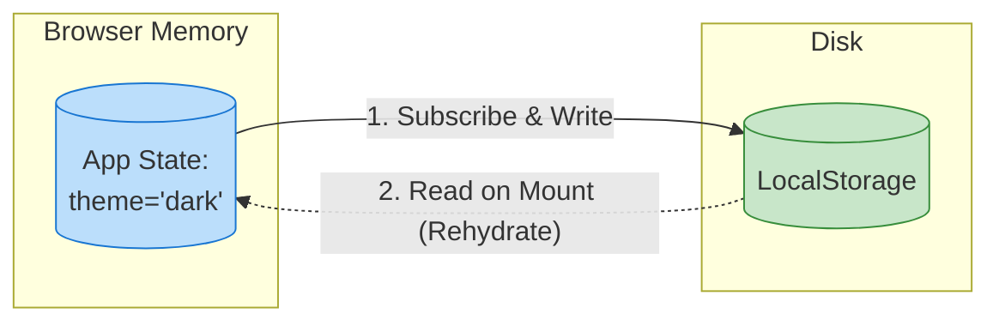

# State Persistence (Персистентность состояния)

## Инженерная история: Память как у слона

Самый частый UX-кошмар: пользователь 15 минут заполнял сложную форму или настраивал фильтры в таблице, случайно нажал `F5` (или свайпнул назад на телефоне), и страница перезагрузилась. Всё исчезло. 

В браузере оперативная память (где живет React/Redux) очищается при каждом обновлении страницы. **State Persistence (Персистентность)** — это паттерн сохранения определенной части клиентского состояния на жесткий диск пользователя (через LocalStorage, SessionStorage или IndexedDB), чтобы при следующем заходе на сайт приложение могло восстановить свой контекст.

## Как это работает на практике

Процесс состоит из двух фаз:
1. **Сохранение (Hydration/Sync):** При каждом изменении стейта в памяти, он сериализуется (JSON.stringify) и пишется в хранилище.
2. **Восстановление (Rehydration):** При загрузке страницы приложение сначала читает хранилище, десериализует данные и инициализирует ими стейт-менеджер.



## Примеры кода

### ❌ Антипаттерн: Ручное управление в компонентах

Разработчик вручную пишет данные в LocalStorage при каждом изменении. Это чревато рассинхроном и багами парсинга.

```javascript
function ThemeToggle() {
  // Очень много бойлерплейта для одной переменной
  const [theme, setTheme] = useState(() => localStorage.getItem('theme') || 'light');

  const toggle = () => {
    const newTheme = theme === 'light' ? 'dark' : 'light';
    setTheme(newTheme);
    localStorage.setItem('theme', newTheme);
  };
}
```

### ✅ Правильное решение: Middleware стейт-менеджера (Zustand)

Библиотека сама берет на себя подписку, дебоунс записи и парсинг.

```javascript
import { create } from 'zustand';
import { persist, createJSONStorage } from 'zustand/middleware';

const useStore = create(
  persist(
    (set) => ({
      theme: 'light',
      toggleTheme: () => set((state) => ({ theme: state.theme === 'light' ? 'dark' : 'light' })),
      
      // ВАЖНО: Эти данные мы НЕ хотим сохранять
      isLoading: false,
    }),
    {
      name: 'app-storage', // Ключ в localStorage
      storage: createJSONStorage(() => localStorage),
      // Опционально: фильтруем то, что сохраняем!
      partialize: (state) => ({ theme: state.theme }), 
    }
  )
);
```

## Неочевидные нюансы и границы применимости

- **Гидратация и SSR (Next.js):** Если вы рендерите страницу на сервере (SSR), сервер ничего не знает о LocalStorage. Сервер отрендерит "светлую" тему, а клиент при загрузке прочитает "темную". Произойдет конфликт гидратации (Hydration Mismatch). Решение: рендерить персистентные данные только после `useEffect` на клиенте, либо хранить настройки в Cookies (которые сервер видит).
- **Отравленный кэш (Poisoned State):** Если вы обновили структуру данных в коде (например, переименовали `theme` в `colorMode`), а у пользователя в LocalStorage лежит старый JSON, приложение может упасть. Обязательно используйте миграции версий (в Zustand `persist` есть поле `version` и `migrate`).
- **Сброс эфемерных флагов:** Никогда не персистируйте флаги `isLoading`, `isError`, иначе пользователь зайдет на сайт и навсегда увидит бесконечный спиннер (ведь флаг восстановился из кэша). Фильтруйте стейт через `partialize`.
