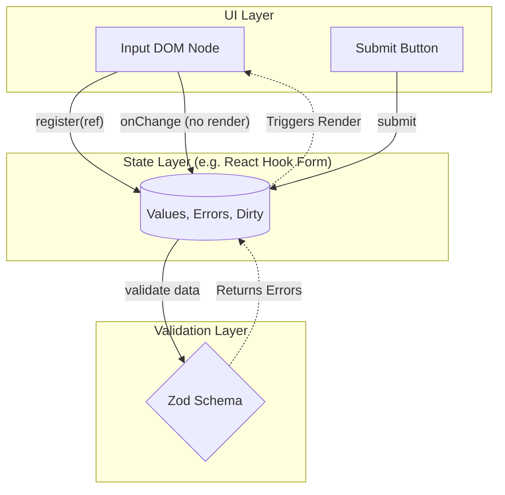

# Form Architecture (Архитектура форм)

## Инженерная история: Самая сложная часть фронтенда

Формы кажутся простыми: пара инпутов и кнопка. Но на деле сложная форма (например, оформление кредита) — это монстр. Это стейт-машина состояний (idle, validating, submitting, success, error), это сложные зависимости (если выбран чекбокс А, покажи инпут Б и сделай его обязательным), это асинхронные проверки (свободен ли email?) и грязный/нетронутый стейт полей (dirty/touched).

Исторически формы писали "в лоб": создавали `useState` для каждого поля и писали спагетти-код проверок на `onSubmit`. Хорошая архитектура форм строится на трех независимых слоях: **Состояние (State)**, **Валидация (Validation/Schema)** и **Представление (UI)**.

## Как это работает на практике

Современный стандарт (например, React Hook Form) использует паттерн "Headless UI" и неуправляемые (uncontrolled) компоненты. Состояние формы хранится в ссылках (Refs) вне цикла рендеринга React, а валидация вынесена в отдельную схему (например, Zod или Yup).



## Примеры кода

### ❌ Антипаттерн: Управляемые компоненты + Ручная валидация

Огромный компонент, который перерендеривается полностью при вводе *каждого* символа.

```javascript
function CheckoutForm() {
  // Бойлерплейт
  const [email, setEmail] = useState('');
  const [password, setPassword] = useState('');
  const [errors, setErrors] = useState({});

  const handleSubmit = (e) => {
    e.preventDefault();
    // Ручная логика, которую сложно переиспользовать и тестировать
    const newErrors = {};
    if (!email.includes('@')) newErrors.email = 'Bad email';
    if (password.length < 6) newErrors.password = 'Too short';
    
    if (Object.keys(newErrors).length > 0) setErrors(newErrors);
    else api.submit(email, password);
  };

  return <input value={email} onChange={e => setEmail(e.target.value)} />;
}
```

### ✅ Правильное решение: Разделение слоев (RHF + Zod)

Слой данных и валидации полностью отделен от UI. Нет лишних рендеров.

```javascript
import { useForm } from 'react-hook-form';
import { zodResolver } from '@hookform/resolvers/zod';
import { z } from 'zod';

// 1. Validation Layer
const schema = z.object({
  email: z.string().email('Bad email'),
  password: z.string().min(6, 'Too short'),
});

function CheckoutForm() {
  // 2. State Layer
  const { register, handleSubmit, formState: { errors } } = useForm({
    resolver: zodResolver(schema)
  });

  const onSubmit = (data) => api.submit(data);

  // 3. UI Layer
  // Никаких useState! Ввод текста не вызывает ререндер формы.
  return (
    <form onSubmit={handleSubmit(onSubmit)}>
      <input {...register('email')} />
      {errors.email && <span>{errors.email.message}</span>}
      
      <input type="password" {...register('password')} />
      <button type="submit">Submit</button>
    </form>
  );
}
```

## Неочевидные нюансы и границы применимости

- **Controlled vs Uncontrolled:** React Hook Form по умолчанию использует неуправляемые инпуты (refs), что дает максимальную производительность (формы из 100 полей не тормозят). Но если вам нужен кастомный UI-компонент из библиотеки (например, `Select` из Material UI), его придется оборачивать в `Controller`, искусственно делая его "управляемым".
- **Динамические поля (Field Arrays):** Архитектура должна легко поддерживать массивы полей (например, "Добавить еще один телефон"). Управление индексами массива вручную — это ад, всегда используйте `useFieldArray`.
- **Глобальный стейт:** Никогда не храните состояние каждого поля ввода в Redux. Это приведет к отправке экшена и пересчету всего дерева на каждое нажатие клавиши. Стейт формы всегда локален, пока форма не засабмичена.
