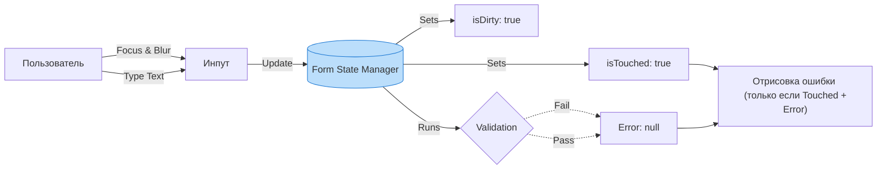

# Form State Management (Управление состоянием форм)

## Инженерная история: Анатомия поля ввода

На первый взгляд поле ввода — это просто текст. Но в реальности, чтобы обеспечить хороший UX, мы должны отслеживать сложную матрицу метаданных для каждого поля и для формы целиком. Управление состоянием формы сводится к управлению этими флагами.

Для каждого поля нужно знать:
- **Value:** текущее значение.
- **Touched:** был ли фокус в этом поле? (Мы не должны показывать ошибку "Поле обязательно", пока пользователь вообще в него не кликнул).
- **Dirty:** было ли значение изменено относительно первоначального (`initialValues`)?
- **Error:** текст ошибки валидации.

Для формы целиком:
- **isValid:** можно ли разблокировать кнопку "Отправить"?
- **isSubmitting:** идет ли сетевой запрос?

## Как это работает на практике

Ручное управление десятками флагов превращает код в лапшу. Поэтому стейт-менеджмент форм абстрагируется в специализированные библиотеки (React Hook Form, Formik, TanStack Form), которые собирают эти данные под капотом и выдают вам готовый объект состояния.



## Примеры кода

### ❌ Антипаттерн: Ручное управление метаданными

Если пытаться делать это на `useState`, код растет в геометрической прогрессии с каждым новым полем.

```javascript
function SimpleForm() {
  const [email, setEmail] = useState('');
  const [emailTouched, setEmailTouched] = useState(false);
  const [emailError, setEmailError] = useState('');

  const handleBlur = () => {
    setEmailTouched(true);
    if (!email.includes('@')) setEmailError('Invalid email');
  };

  return (
    <div>
      <input 
        value={email} 
        onChange={e => setEmail(e.target.value)} 
        onBlur={handleBlur} 
      />
      {emailTouched && emailError && <span>{emailError}</span>}
    </div>
  );
}
```

### ✅ Правильное решение: Использование Form State Manager

Библиотека (например, Formik) берет управление флагами на себя.

```javascript
import { useFormik } from 'formik';

function SimpleForm() {
  const formik = useFormik({
    initialValues: { email: '' },
    validate: values => {
      const errors = {};
      if (!values.email.includes('@')) errors.email = 'Invalid email';
      return errors;
    },
    onSubmit: values => console.log(values),
  });

  return (
    <form onSubmit={formik.handleSubmit}>
      <input
        name="email"
        value={formik.values.email}
        onChange={formik.handleChange}
        onBlur={formik.handleBlur} // Автоматически выставит touched.email = true
      />
      {/* Отрисовываем ошибку только если поле трогали */}
      {formik.touched.email && formik.errors.email ? (
        <span>{formik.errors.email}</span>
      ) : null}
    </form>
  );
}
```

## Неочевидные нюансы и границы применимости

- **Момент валидации (Validate on Change vs Submit):** Если валидировать на каждое нажатие (onChange), пользователь увидит ошибку "Слишком короткий пароль" сразу после ввода первой буквы, что бесит. Если валидировать только по кнопке (onSubmit), реакция системы будет слишком поздней. Золотой стандарт: начать валидировать onChange *только после того*, как поле стало `Touched` (onBlur) или после первой неудачной попытки Submit.
- **Сброс состояния (Reset):** При успешной отправке нужно вернуть форму к `initialValues` и сбросить флаги `isDirty` и `isTouched`. Если вы обновляете данные формы с сервера, убедитесь, что библиотека форм поддерживает сброс (например, свойство `enableReinitialize` в Formik).
- **Производительность:** Formik перерендеривает всю форму при любом изменении. Для форм с >20 полями лучше использовать React Hook Form, который обновляет локально.
