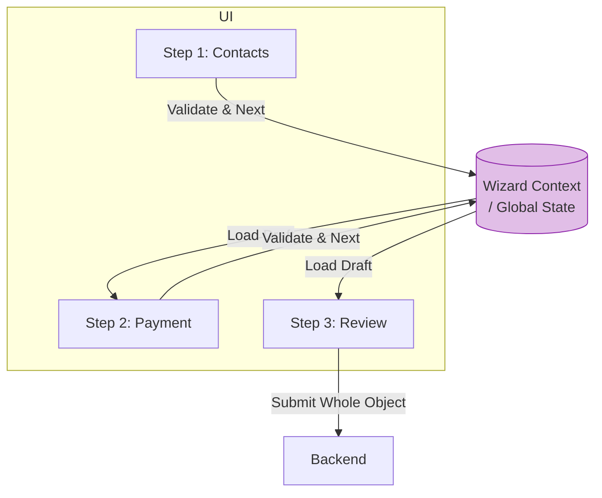

# Multi Step Forms (Многошаговые формы / Wizards)

## Инженерная история: Иллюзия простоты

Когда форма содержит 50 полей (например, оформление ипотеки), показывать их все сразу — верный способ испугать пользователя. Мы разбиваем процесс на шаги (Шаг 1: Личные данные, Шаг 2: Документы, Шаг 3: Оплата). Такие интерфейсы называют Wizards (Мастера).

Главная архитектурная проблема мастера: **сохранение состояния между шагами**. Когда пользователь переходит от Шага 1 к Шагу 2, компонент первого шага размонтируется (уничтожается). Если хранить состояние в локальном `useState` внутри шага, данные пропадут. Нам нужно "поднять" состояние (Lift State Up), чтобы оно пережило навигацию.

## Как это работает на практике

Существует три основных подхода к хранению состояния мастера:
1. **Глобальный Context/Store:** Форма оборачивается в Провайдер, и каждый шаг пишет данные в общий котел. Сабмит происходит на последнем шаге.
2. **URL / URLSearchParams:** Данные сохраняются прямо в адресную строку (подходит только для коротких публичных данных, вроде фильтров поиска).
3. **Сохранение на сервере (Drafts):** При переходе с Шага 1 на Шаг 2 данные *сразу* отправляются на сервер, создавая черновик. Следующий шаг просто дописывает в этот черновик. (Самый надежный способ для сложных бизнес-процессов).



## Примеры кода

### ❌ Антипаттерн: Проп-дриллинг и "Божественный компонент"

Один гигантский компонент хранит весь стейт и рендерит шаги через `switch/case`. Файл разрастается до 2000 строк.

```javascript
function Wizard() {
  const [step, setStep] = useState(1);
  const [name, setName] = useState('');
  const [card, setCard] = useState('');

  // Этот компонент станет нечитаемым
  return (
    <div>
      {step === 1 && <Step1 name={name} setName={setName} onNext={() => setStep(2)} />}
      {step === 2 && <Step2 card={card} setCard={setCard} onNext={() => api.submit()} />}
    </div>
  );
}
```

### ✅ Правильное решение: FormProvider (React Hook Form)

Используем контекст библиотеки форм. Шаги — это изолированные компоненты, которые читают/пишут из/в глобальную форму.

```javascript
import { useForm, FormProvider, useFormContext } from 'react-hook-form';

// Главный оркестратор
function Wizard() {
  const methods = useForm(); // Хранит стейт всех шагов
  const [step, setStep] = useState(1);

  const onSubmit = (data) => api.saveEverything(data);

  return (
    // Оборачиваем шаги в провайдер!
    <FormProvider {...methods}>
      <form onSubmit={methods.handleSubmit(onSubmit)}>
        {step === 1 && <Step1 onNext={() => setStep(2)} />}
        {step === 2 && <Step2 onBack={() => setStep(1)} />}
      </form>
    </FormProvider>
  );
}

// Изолированный шаг
function Step1({ onNext }) {
  const { register, trigger } = useFormContext(); // Достаем стейт из контекста
  
  const handleNext = async () => {
    // Валидируем только текущие поля перед переходом
    const isStepValid = await trigger(['name', 'email']); 
    if (isStepValid) onNext();
  };

  return (
    <div>
      <input {...register('name')} />
      <button type="button" onClick={handleNext}>Далее</button>
    </div>
  );
}
```

## Неочевидные нюансы и границы применимости

- **Частичная валидация:** Вы не можете запустить стандартный `handleSubmit` библиотеки форм при переходе на Шаг 2, потому что поля Шага 3 еще пустые, и форма невалидна! Нужно вручную вызывать триггер валидации (`trigger(['field1', 'field2'])`) только для текущих полей.
- **Нелинейная навигация:** Если пользователь может прыгать по табам "Шаг 1 -> Шаг 3", минуя Шаг 2, вам потребуется сложная машина состояний (XState), чтобы отслеживать, какие шаги заполнены, а какие заблокированы.
- **Сохранение при обновлении:** Если хранить мастера только в React Context, обновление страницы (`F5`) уничтожит 30 минут работы. Для больших мастеров (более 3 шагов) обязательно делайте либо локальное кэширование (State Persistence), либо серверные черновики на каждый шаг.
