# React Hook Form

## Инженерная история: Триумф неуправляемых компонентов

В мире React годами господствовала мантра: "Все инпуты должны быть управляемыми (Controlled Components)". Это означало, что состояние инпута хранится в `useState`, и при каждом нажатии клавиши компонент формы полностью перерендеривается. Для формы из двух полей это нормально. Но для формы из 100 полей (или со сложными таблицами) ввод одного символа начинал занимать 300 мс, интерфейс безбожно тормозил.

**React Hook Form (RHF)** совершил революцию, вернувшись к истокам DOM — **неуправляемым (Uncontrolled) компонентам**. RHF использует `ref`, чтобы "зарегистрировать" инпут в своем внутреннем хранилище. Когда пользователь печатает, React об этом даже не знает! Никаких перерендеров не происходит. RHF достает значения из DOM напрямую только в тот момент, когда это действительно нужно (например, при сабмите или валидации).

## Как это работает на практике

Библиотека выступает невидимым мостом между нативным DOM и React. Вы вызываете хук `useForm`, получаете функцию `register` и прокидываете ее в инпуты. 

```mermaid
graph TD
    subgraph ReactRenderCycle ["React Render Cycle"]
    Render["Initial Render"]
    Errors["Render Errors (if any)"]
    end
    
    subgraph NativeDOM ["Native DOM"]
    DOM["<input ref={...} />"]
    end
    
    subgraph RHFInternalState ["RHF Internal State"]
    State[("Values, Dirty, Valid")]
    end
    
    Render --> DOM
    DOM -->|"User Types (Bypasses React)"| State
    State -->|"Validation fails"| Errors
    
    style DOM fill:#c8e6c9,stroke:#388e3c
    style State fill:#e1bee7,stroke:#8e24aa
```



## Примеры кода

### ❌ Антипаттерн: Управляемая форма (Formik / классический React)

Каждое нажатие на клавиатуру вызывает ререндер компонента.

```javascript
function SlowForm() {
  const [name, setName] = useState('');
  
  console.log('Я рендерюсь при каждом символе!');
  
  return <input value={name} onChange={e => setName(e.target.value)} />;
}
```

### ✅ Правильное решение: React Hook Form

Сверхбыстрая форма без лишних перерендеров.

```javascript
import { useForm } from 'react-hook-form';

function FastForm() {
  const { register, handleSubmit } = useForm();
  
  console.log('Я отрендерился всего ОДИН раз!');

  const onSubmit = data => console.log(data); // data.name будет доступно здесь

  return (
    <form onSubmit={handleSubmit(onSubmit)}>
      {/* register сам прокидывает ref, onChange, onBlur */}
      <input {...register("firstName", { required: true, minLength: 2 })} />
      <button type="submit">Send</button>
    </form>
  );
}
```

## Неочевидные нюансы и границы применимости

- **Проблема кастомных UI-библиотек:** RHF идеально работает с нативными `<input>`. Но если вы используете UI-кит (MUI, Ant Design, React Select), их компоненты часто скрывают нативный `ref` или работают только как управляемые. Чтобы "подружить" их с RHF, приходится использовать компонент-обертку `<Controller>`. Это возвращает ререндеры для конкретного поля, но сохраняет общую архитектуру формы.
- **Отслеживание изменений (watch):** Если вам *действительно* нужно реагировать на каждое нажатие (например, показывать прогресс-бар пароля), вы используете метод `watch('password')`. Это заставит компонент перерендериваться, но только по явному запросу.
- **Размер бандла:** Библиотека невероятно крошечная, не имеет зависимостей и обладает идеальной поддержкой TypeScript (типы полей выводятся из схемы валидации). Это текущий золотой стандарт (Industry Standard) для создания форм в React.
