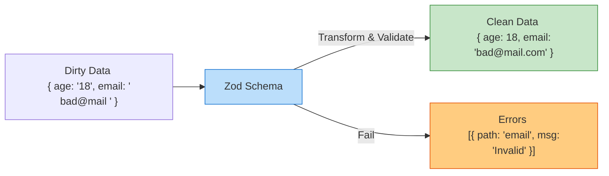

# Schema Validation (Валидация по схеме)

## Инженерная история: Код как декларация намерений

Исторически правила валидации форм писались императивно, в виде огромных "простыней" из `if-else`. Это приводило к дублированию кода, сложностям с локализацией ошибок и полной потере типизации (TypeScript не мог понять, валиден объект или нет, опираясь только на `if`).

**Schema Validation** решает эту боль, предлагая декларативный подход. Вы создаете "схему" (Schema) — объект, который математически описывает, как должны выглядеть правильные данные. Библиотека (Zod, Yup, Joi, Valibot) берет сырые данные, прогоняет их через эту схему и возвращает либо идеально типизированный валидный объект, либо структурированный массив ошибок.

## Как это работает на практике

Схема выступает в роли "Таможни" (Gatekeeper) между грязным внешним миром (пользовательский ввод, ответы API) и чистой бизнес-логикой вашего приложения.



## Примеры кода

### ❌ Антипаттерн: Ручная (императивная) валидация

Много кода, нет гарантий типа, легко допустить ошибку при приведении типов.

```javascript
function validateUser(data) {
  const errors = {};
  if (!data.email || !data.email.includes('@')) errors.email = 'Bad email';
  if (typeof data.age !== 'number') {
    const ageNum = parseInt(data.age, 10);
    if (isNaN(ageNum) || ageNum < 18) errors.age = 'Must be adult';
    data.age = ageNum; // Мутация грязных данных!
  }
  return { isValid: Object.keys(errors).length === 0, errors, data };
}
```

### ✅ Правильное решение: Zod Схема

Один источник истины для типов (TypeScript) и логики валидации. Автоматический парсинг (coercion) и очистка.

```typescript
import { z } from 'zod';

// 1. Декларируем схему
const UserSchema = z.object({
  email: z.string().email('Неверный формат email').trim(),
  // coerce автоматически преобразует строку "18" в число 18
  age: z.coerce.number().min(18, 'Только для взрослых'), 
});

// 2. Автоматический вывод типа для TypeScript!
type User = z.infer<typeof UserSchema>; 
// type User = { email: string; age: number; }

// 3. Использование (бросает ошибку или возвращает чистые данные)
try {
  const cleanData = UserSchema.parse({ email: ' test@mail.com ', age: '20' });
  // cleanData.age теперь ТОЧНО number (20)
  // cleanData.email ТОЧНО без пробелов ("test@mail.com")
} catch (e) {
  console.log(e.errors);
}
```

## Неочевидные нюансы и границы применимости

- **Parse, don't validate (Парси, а не валидируй):** Это главный девиз схем валидации. Схема не просто отвечает "Да/Нет" (валидация). Она берет грязные данные и *создает* из них новый, гарантированно чистый объект (парсинг), обрезая лишние пробелы (trim), удаляя неизвестные поля (strip) и преобразуя типы (coerce).
- **Шаринг между Front и Back:** Самая мощная киллер-фича Zod (в связке с монорепозиториями или tRPC). Вы пишете схему `LoginSchema` один раз в папке `shared`. React Hook Form использует её для валидации формы на клиенте. А бэкенд на Node.js использует её же для валидации входящего тела запроса (`req.body`). 100% гарантия совпадения контрактов.
- **Размер бандла:** Yup весит довольно много, Zod — средне, Valibot — экстремально мало (благодаря tree-shaking). Для современных проектов Zod является стандартом индустрии из-за идеального DX (Developer Experience).
