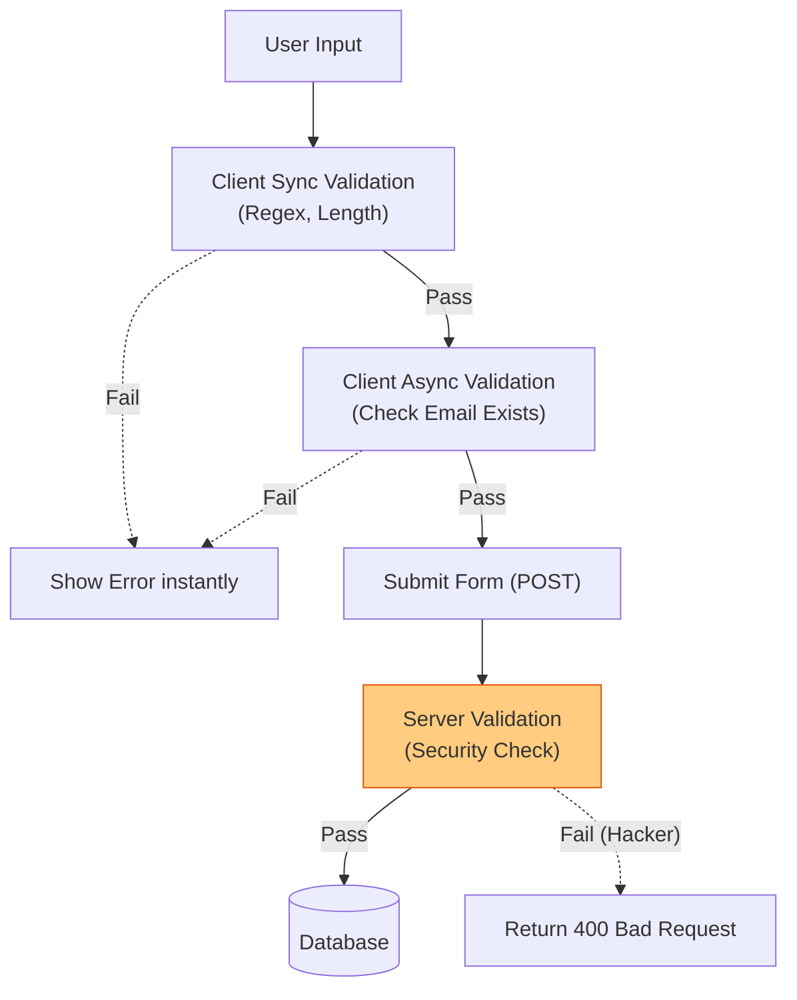

# Validation (Валидация)

## Инженерная история: Защита от дурака и хакера

Валидация (проверка корректности данных) преследует две совершенно разные цели, которые новички часто путают. 
Первая цель — **UX (User Experience)**. Мы хотим помочь пользователю заполнить форму правильно: подсказать, что пароль слишком короткий, или что в номере телефона не хватает цифры, *до* того, как он нажмет "Отправить". Это делается на фронтенде.
Вторая цель — **Безопасность и целостность данных**. Мы должны гарантировать, что в базу данных не попадет SQL-иньекция, отрицательный возраст или чужой ID. Это делается *только на бэкенде*.

Золотое правило веб-разработки: **Клиентская валидация — это забота о пользователе. Серверная валидация — это забота о системе. Одно не заменяет другое.**

## Как это работает на практике

Валидация делится на синхронную и асинхронную.
- **Синхронная (Synchronous):** Проверки, для которых не нужен сервер (длина строки, регулярное выражение email, совпадение паролей). Выполняется мгновенно.
- **Асинхронная (Asynchronous):** Проверки, требующие запроса к БД (свободен ли этот логин? существует ли такой промокод?). Запускается с задержкой (debounce), чтобы не DDoS-ить собственный сервер при вводе каждого символа.



## Примеры кода

### ❌ Антипаттерн: Агрессивная валидация на каждый чих

Пользователь только начал писать `al...`, а интерфейс уже орет на него красным цветом: "НЕВЕРНЫЙ EMAIL!". Это раздражает.

```javascript
// Плохо: Валидация при каждом рендере без учета Touch
function Form({ email }) {
  const isError = !email.includes('@');
  return <input style={{ border: isError ? 'red' : 'black' }} />;
}
```

### ✅ Правильное решение: Продуманный UX (Ленивая валидация)

Мы валидируем поле только тогда, когда пользователь закончил с ним работать (`onBlur`), либо если он уже попытался отправить форму с ошибками.

```javascript
function FriendlyForm() {
  const { register, formState: { errors, touchedFields } } = useForm({
    mode: 'onTouched', // Магия: валидация срабатывает только когда фокус ушел из поля
  });

  return (
    <div>
      <input {...register('username', { required: 'Введите имя' })} />
      {/* Ошибка появится, только если пользователь кликнул в поле и ушел, оставив его пустым */}
      {errors.username && touchedFields.username && <p>{errors.username.message}</p>}
    </div>
  );
}
```

## Неочевидные нюансы и границы применимости

- **Доверие к клиенту равно нулю:** Вы можете написать идеальную регулярку на фронтенде, запрещающую вводить спецсимволы в имя. Но любой человек может открыть консоль браузера (или Postman) и отправить POST-запрос с `name: "<script>alert(1)</script>"` напрямую на ваш сервер, минуя ваш React-код. Сервер *обязан* иметь дублирующую валидацию.
- **Прощение опечаток (Forgiving UI):** Хорошая валидация нормализует данные за пользователя. Если он ввел телефон как `+7 (999) 123 45`, а база ждет `799912345`, фронтенд должен сам вырезать скобки и пробелы (trim/replace), а не заставлять пользователя переписывать всё руками.
- **Асинхронная гонка:** При реализации асинхронной проверки "свободен ли логин" нужно обязательно использовать Debounce (например, 500мс) и отмену предыдущих запросов (AbortController), иначе ответы сервера могут прийти в неправильном порядке и показать валидный логин как занятый.
