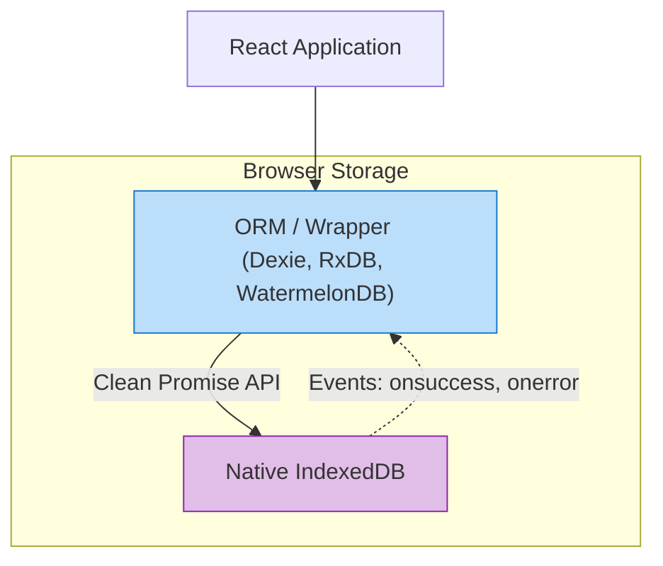

# ORM для IndexedDB

## Инженерная история: Укрощение динозавра

IndexedDB — это невероятно мощная, встроенная в каждый современный браузер NoSQL база данных. Она работает асинхронно, поддерживает транзакции, индексы и может хранить гигабайты данных (включая файлы и бинарники). Звучит идеально для создания мощных веб-приложений. 

Проблема в одном: нативный API IndexedDB создавался в те времена, когда промисов (`Promises`) еще не существовало. Он работает на низкоуровневых событиях (`onsuccess`, `onerror`, `onupgradeneeded`). Чтобы просто сохранить один объект, вам нужно написать около 40 строк чудовищного, вложенного кода. Никто в здравом уме не использует чистый IndexedDB в продакшене. Сообщество создало ORM и обертки, которые превращают этого монстра в удобный инструмент.

## Как это работает на практике

Библиотеки-обертки прячут от вас работу с событиями, транзакциями и (самое страшное) миграциями схем баз данных, предоставляя чистый, промис-базированный (или реактивный) API.



## Примеры кода

### ❌ Антипаттерн: Нативный IndexedDB

Боль. Отчаяние. Callback Hell.

```javascript
const request = window.indexedDB.open("MyTestDatabase", 3);

request.onerror = (event) => { console.error("Database error: " + event.target.errorCode); };
request.onsuccess = (event) => {
  const db = event.target.result;
  const transaction = db.transaction(["customers"], "readwrite");
  const objectStore = transaction.objectStore("customers");
  const requestUpdate = objectStore.put({ id: 1, name: "Alice" });
  requestUpdate.onsuccess = () => { console.log("Success!"); };
};
// И мы еще даже не написали код обновления схемы базы данных...
```

### ✅ Правильное решение: Использование ORM (на примере Dexie.js)

Лаконично, читаемо и с типами.

```javascript
import Dexie from 'dexie';

// 1. Декларация базы и индексов
const db = new Dexie("MyDatabase");
db.version(1).stores({
  friends: '++id, name, age' // Primary key "id" (auto-increment), indexes on name/age
});

// 2. Использование (Промисы!)
async function doDatabaseWork() {
  await db.friends.add({ name: "Alice", age: 25 });
  
  const youngFriends = await db.friends
    .where("age").below(30)
    .toArray();
    
  console.log(youngFriends);
}
```

## Неочевидные нюансы и границы применимости

Выбор обертки зависит от задачи:
- **`idb`:** Минималистичная обертка (всего пара килобайт), которая просто переводит нативный API в Promis'ы. Для тех, кто хочет полный контроль.
- **`Dexie.js`:** Де-факто стандарт (самый популярный). Удобный ORM с хуками (`useLiveQuery`), который позволяет React-компонентам перерендериваться при изменении данных в базе.
- **`RxDB` (Reactive Database):** Тяжеловес. База данных реального времени, основанная на RxJS. Она "из коробки" умеет синхронизироваться с сервером (GraphQL, CouchDB). Идеальна для сложных Offline-First приложений.
- **`WatermelonDB`:** Создана для React Native и веба. Оптимизирована на экстремальную производительность (ленивая загрузка связей), чтобы UI не тормозил при загрузке 10 000 записей. Подходит для масштабов Notion или Telegram.
