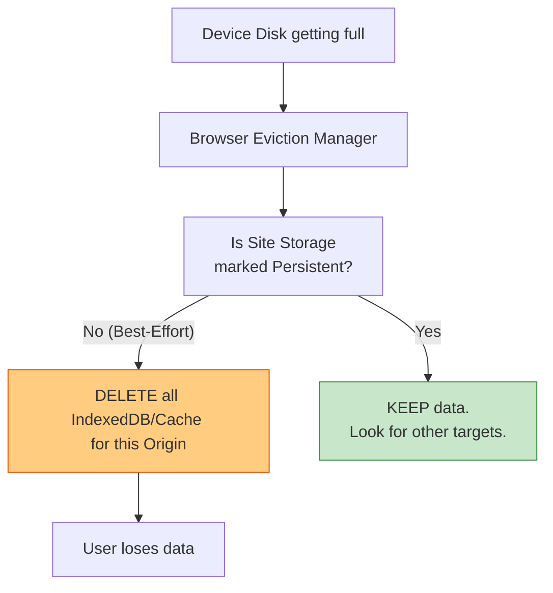

# Управление квотами браузера (Storage Quotas)

## Инженерная история: Беспощадный дворник

Вы создали потрясающее PWA-приложение для рисования. Пользователь работает в нем оффлайн, рисует 50 картин, они сохраняются в IndexedDB на его устройстве. Через месяц он заходит на сайт, а все картины исчезли. Пользователь в ярости. Что произошло?

Устройство пользователя (телефон или ноутбук) переполнилось. Когда на диске остается критически мало места (например, iOS скачивает обновление), браузер начинает паниковать. Он выступает в роли беспощадного дворника: ищет сайты, которыми давно не пользовались, и **молча, без предупреждения, удаляет все их локальные данные** (IndexedDB, Cache Storage, LocalStorage). Этот процесс называется **Eviction (Выселение)**.

По умолчанию всё хранилище в браузере является *Эфемерным (Best-Effort)*. Браузер будет хранить данные, пока может, но не дает никаких гарантий.

## Как это работает на практике

Браузер выделяет каждому источнику (Origin — домен + протокол + порт) определенную **Квоту** (долю от свободного места на диске). Узнать, сколько вам доступно и сколько занято, можно через Storage API. Чтобы защитить данные от удаления, приложение должно явно попросить у браузера статус **Persistent Storage (Надежное хранилище)**.



## Примеры кода

### ❌ Антипаттерн: Слепая вера в браузер

Хранение гигабайтов медиа-файлов или важных черновиков в IndexedDB без проверки квот и персистентности. Данные исчезнут в самый неподходящий момент.

### ✅ Правильное решение: Storage API

Проверяем доступное место и просим браузер не удалять наши данные.

```javascript
// 1. Проверяем квоту (Сколько мегабайт мы уже съели?)
async function checkQuota() {
  if (navigator.storage && navigator.storage.estimate) {
    const { quota, usage } = await navigator.storage.estimate();
    const usedMB = (usage / 1024 / 1024).toFixed(2);
    const maxMB = (quota / 1024 / 1024).toFixed(2);
    console.log(`Использовано: ${usedMB} MB из ${maxMB} MB`);
  }
}

// 2. Запрос надежного (Persistent) хранилища
async function requestPersistence() {
  if (navigator.storage && navigator.storage.persist) {
    // Браузер сам решает, дать ли персистентность. 
    // В Firefox может выскочить попап с запросом к пользователю.
    // В Chrome дается автоматически, если юзер добавил сайт на HomeScreen или часто заходит.
    const isPersistent = await navigator.storage.persist();
    
    if (isPersistent) {
      console.log("Ура! Браузер не удалит наши данные при нехватке места.");
    } else {
      console.warn("Данные в опасности. Нужно предупредить пользователя!");
    }
  }
}
```

## Неочевидные нюансы и границы применимости

- **Критерии браузера:** Chrome дает Persistent-статус тихо, опираясь на метрики вовлеченности (Site Engagement Score). Если юзер закрепил вкладку, добавил сайт на главный экран или разрешил пуш-уведомления — статус будет дан. Safari (iOS) очень агрессивно чистит кэш сайтов, на которые не заходили 7 дней (раньше чистил, сейчас правила смягчаются, но доверять Safari всё еще нельзя).
- **Ручная очистка:** Даже статус Persistent не спасет, если пользователь сам зайдет в настройки браузера и нажмет "Очистить данные сайтов".
- **Синхронизация как план Б:** Единственный способ гарантировать сохранность данных на 100% — это синхронизировать локальную базу данных с удаленным сервером в фоновом режиме (Offline-First архитектура).
- **Лимиты LocalStorage:** На `localStorage` квоты Storage API не распространяются гибко — там жестко вшит лимит в ~5 МБ. Хранить там большие объемы просто невозможно, будет брошено исключение `QuotaExceededError`.
