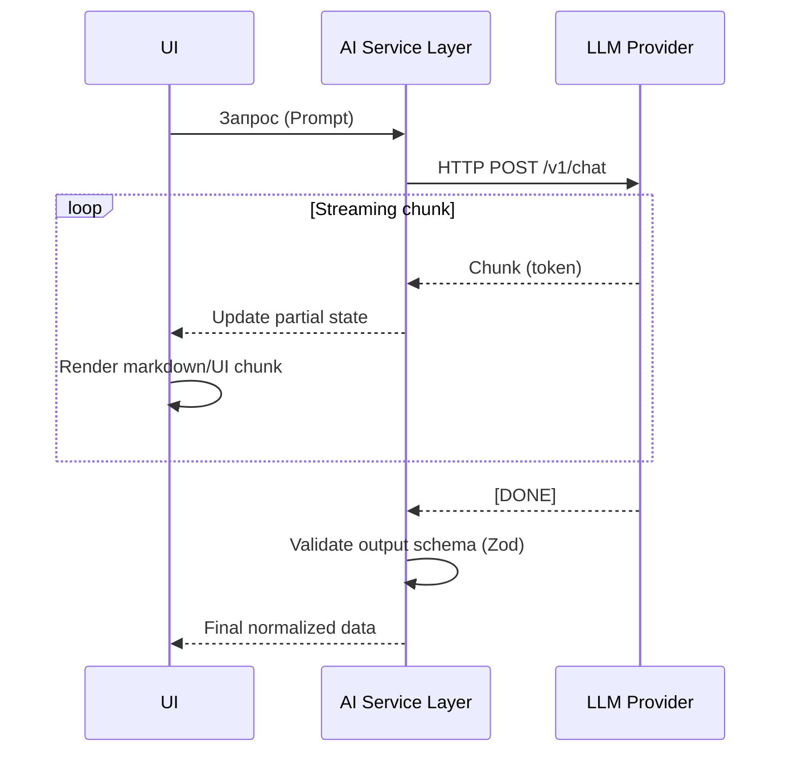

# Architecting AI Interfaces

Интеграция с AI (LLM, генерация картинок, аудио) во frontend-приложениях порождает совершенно новые UX и архитектурные вызовы. Мы больше не получаем детерминированные и структурированные JSON-ответы за 50мс. Генерация может занимать десятки секунд, ответ может приходить кусками (стриминг), а структура ответа может "поплыть" (галлюцинации).

Боль, которую мы решаем — как сделать так, чтобы пользователь не скучал, глядя на спиннер по 30 секунд, и как приложению не упасть, если AI вернул невалидный JSON. Архитектура AI-интерфейсов требует внедрения промежуточных абстракций для парсинга на лету, управления стейтом стриминга и graceful fallback-ов.



### Практическое применение
Применимо в любых Copilot-подобных интерфейсах, чатах с ботами, умном автокомплите. Сложности возникают, когда нужно генерировать не просто текст, а UI-компоненты (Generative UI) на лету. В таких случаях необходимо стримить вызовы функций (tool calls) и парсить аргументы (JSON) до того, как они полностью загрузились.

### Пример кода (Антипаттерн)
Ожидание полного ответа перед показом.
```typescript
async function askAI(prompt: string) {
  setIsLoading(true);
  // Ждем 20 секунд... Пользователь ушел
  const response = await fetch('/api/llm', { body: prompt });
  const result = await response.json();
  setAnswer(result.text);
  setIsLoading(false);
}
```

### Неочевидные нюансы и трейдоффы
1. **Partial JSON Parsing**: Когда вы просите LLM вернуть JSON и используете стриминг, вы будете получать оборванные JSON-строки (`{"name": "Jo`). Вам нужны специализированные парсеры (типа `secure-json-parse` или `partial-json`), которые могут извлекать данные из невалидного JSON на лету для отрисовки промежуточного UI.
2. **LLM Hallucinations**: Никогда не доверяйте структуре ответа AI. Всегда пропускайте финальный результат через валидаторы (например, Zod) перед сохранением в стор или рендерингом сложных компонентов.
3. **Cancellation**: Генерация стоит денег. Если пользователь закрыл модалку или передумал, фронтенд ОБЯЗАН послать `AbortSignal`, чтобы разорвать соединение с бекендом/LLM и остановить генерацию.
