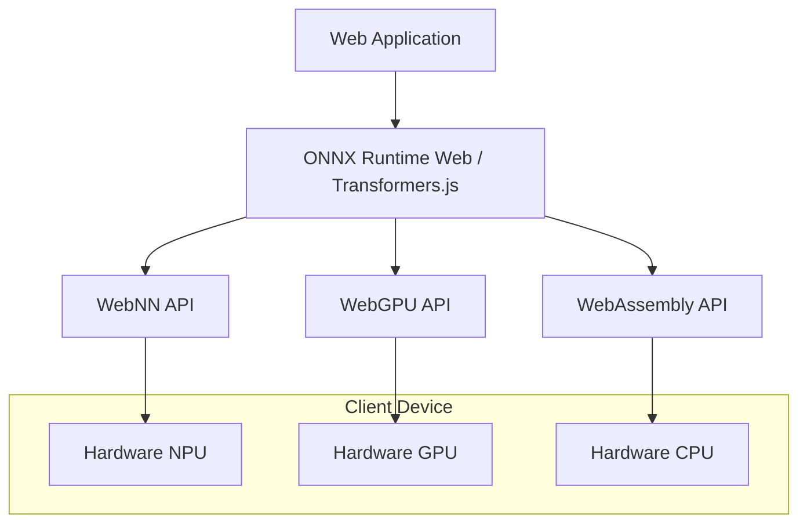

# Local AI и WebNN

Тенденция на "толстые" клиенты достигла своего апогея: теперь мы можем запускать LLM и нейросети прямо в браузере пользователя. Это решает сразу три огромные боли: приватность (данные не покидают устройство), стоимость серверов (инференс оплачивает пользователь своей батареей) и latency/offline-доступ (работает без интернета с нулевым пингом).

**WebNN (Web Neural Network API)** и технологии вроде WebGPU/WASM позволяют обращаться напрямую к NPU/GPU устройства для аппаратного ускорения инференса. 



### Как это работает на практике
Вы загружаете квантованную (сжатую) модель (например, Llama 3 8B q4 или Whisper) в браузерный кэш (IndexedDB). Затем инициализируете WebWorker, внутри которого крутится инференс через условный `transformers.js` или ONNX Runtime Web. Основной поток общается с воркером через `postMessage`, передавая промпты и получая токены.

### Пример кода (Правильный подход)
Инференс всегда выносится в WebWorker, чтобы не блокировать Main Thread.
```typescript
// main.ts
const worker = new Worker(new URL('./ai.worker.ts', import.meta.url));

worker.postMessage({ type: 'GENERATE', prompt: 'Summarize this text...' });
worker.onmessage = (e) => {
    if (e.data.status === 'chunk') updateUI(e.data.chunk);
    if (e.data.status === 'done') finishUI();
};

// ai.worker.ts
import { pipeline } from '@xenova/transformers';

let generator;
self.addEventListener('message', async (e) => {
    if (!generator) generator = await pipeline('text-generation', 'Xenova/TinyLlama-1.1B');
    
    await generator(e.data.prompt, {
        callback_function: (chunks) => self.postMessage({ status: 'chunk', chunk: chunks[0] })
    });
    self.postMessage({ status: 'done' });
});
```

### Неочевидные нюансы и границы применимости
1. **Первоначальная загрузка (Cold Start)**: Модели весят сотни мегабайт или даже гигабайты. Пользователю придется скачать их при первом запуске, что убивает конверсию и First Contentful Paint.
2. **Расход памяти**: Chrome вкладка может легко крашнуться (OOM), если попытаться загрузить слишком большую модель на слабом смартфоне.
3. **Отсутствие стандартизации**: WebNN API пока работает не везде (в основном в новых Chromium). В качестве фоллбека используется WebGPU, а затем WASM, что влияет на скорость инференса.
