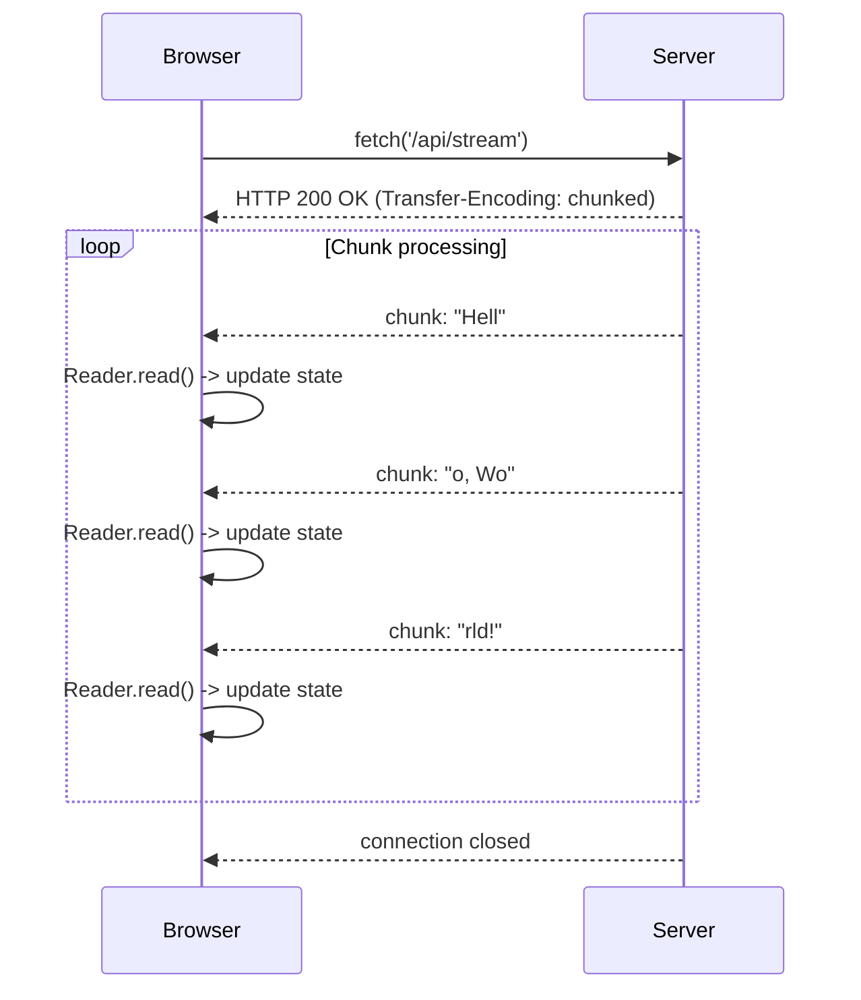

# Streaming Responses (Потоковые ответы)

Исторически REST API работали по принципу request-response: отправляем запрос, ждём, пока сервер сформирует весь ответ, получаем кусок JSON. Но с появлением LLM генерация ответа стала занимать десятки секунд. Чтобы пользователь не смотрел на лоадер, применяется потоковая передача (Streaming) поверх HTTP (обычно через Server-Sent Events или Fetch Streams).

Боль, которую мы решаем — уменьшение Time To First Byte (TTFB) и улучшение воспринимаемой производительности. Мы начинаем показывать данные ровно в тот момент, когда сервер их произвел.



### Как это работает на практике
Современный `fetch` API в браузерах возвращает объект `Response`, у которого свойство `body` является `ReadableStream`. Мы можем получить `reader` и читать ответ по частям (чанками), декодируя байты в текст через `TextDecoder`.

### Пример кода (Правильное решение)
```typescript
async function fetchStream() {
  const response = await fetch('/api/generate', { method: 'POST' });
  const reader = response.body?.getReader();
  const decoder = new TextDecoder();
  let resultText = '';

  if (!reader) return;

  try {
    while (true) {
      const { done, value } = await reader.read();
      if (done) break;
      
      const chunk = decoder.decode(value, { stream: true });
      resultText += chunk;
      // Обновляем UI с каждым новым чанком
      updateUI(resultText); 
    }
  } finally {
    reader.releaseLock();
  }
}
```

### Неочевидные нюансы и оверхед
1. **Промежуточные буферы**: Иногда прокси (Nginx, Cloudflare) или антивирусы буферизуют ответ, ожидая его полного завершения, прежде чем отдать клиенту. В таком случае стриминг ломается, и клиент получает весь текст разом. Обязательно нужно отключать буферизацию (например, заголовок `X-Accel-Buffering: no` для Nginx).
2. **Разрыв потока (Tearing)**: При декодировании через `TextDecoder` многобайтовый символ (например, эмодзи) может быть разрезан пополам между двумя чанками. Флаг `{ stream: true }` в `decode()` критически важен, так как он сохраняет "половинку" символа до следующего чанка, предотвращая кракозябры.
3. **Отмена стрима**: Если компонент размонтировался, нужно не только перестать обновлять стейт, но и вызвать `reader.cancel()` или использовать `AbortController`, чтобы сервер прекратил дорогую генерацию (особенно актуально для LLM).
