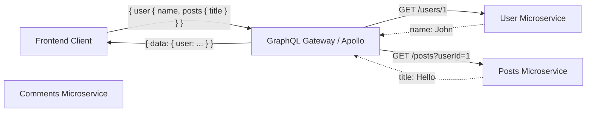

# GraphQL

GraphQL — это язык запросов к API и среда выполнения для выполнения этих запросов. Он был создан Facebook для решения двух главных проблем REST в сложных приложениях: Under-fetching (когда нужно сделать 10 запросов, чтобы собрать страницу) и Over-fetching (когда ради имени пользователя мы тянем 500 КБ JSON со всеми его постами и лайками).

С GraphQL клиент сам диктует серверу, какую именно структуру данных он хочет получить. Больше никаких `/api/users`, `/api/posts?userId=1`. Вместо этого у нас одна точка входа (обычно `/graphql`), куда мы отправляем структурированный запрос.



### Как это работает на практике
Вы описываете строгую схему данных на сервере (типы, запросы, мутации). Клиент использует инструменты вроде Apollo Client, Relay или URQL, которые не только делают запросы, но и нормализуют ответы, складывая их в умный кеш. Изменение сущности в одном месте автоматически обновляет её во всех компонентах.

### Пример кода (Правильное решение)
Использование GraphQL с умным клиентом, который берет на себя кеширование.
```tsx
const GET_USER_PROFILE = gql`
  query GetUserProfile($id: ID!) {
    user(id: $id) {
      id
      name
      avatarUrl
      recentPosts(limit: 3) {
        id
        title
      }
    }
  }
`;

function UserProfile({ userId }) {
  // Apollo Client сам сходит за данными и положит их в normalized cache
  const { loading, error, data } = useQuery(GET_USER_PROFILE, {
    variables: { id: userId },
  });

  if (loading) return <Spinner />;
  return <h1>{data.user.name}</h1>;
}
```

### Неочевидные нюансы и границы применимости
1. **Сложность кеширования на уровне CDN**: В отличие от REST, где можно закешировать `GET /api/users/1` на уровне Nginx или Cloudflare, GraphQL-запросы идут через `POST`, и их тела постоянно разные. Для кеширования приходится использовать Persisted Queries (когда запрос хешируется).
2. **Проблема N+1**: Из-за древовидной природы запроса сервер может сделать 1 запрос к юзерам и 100 запросов к постам. Это решается на бекенде через DataLoader (батчинг запросов).
3. **Огромный оверхед для простых CRUD**: Если у вас приложение-админка с тремя таблицами, тащить GraphQL, настраивать схему и резолверы — это стрельба из пушки по воробьям. REST будет дешевле и быстрее.
