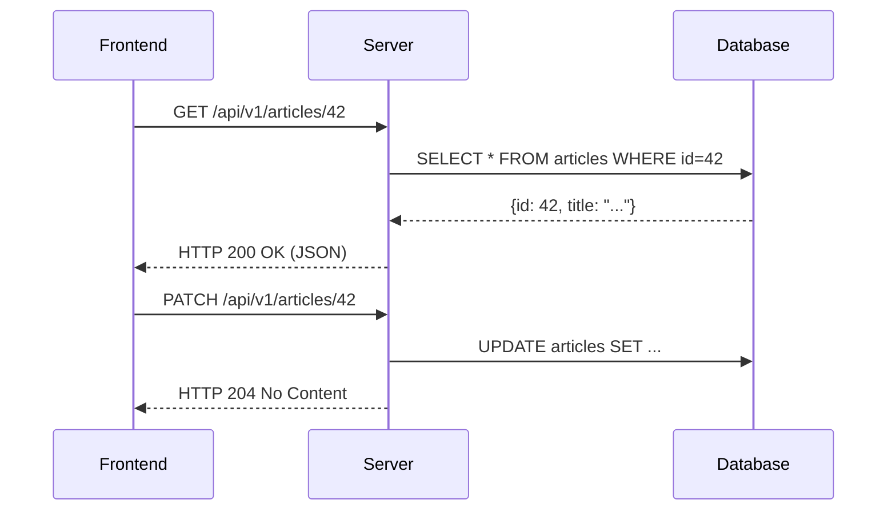

# REST (Representational State Transfer)

REST — это архитектурный стиль взаимодействия компонентов распределённого приложения в сети, де-факто стандарт веб-индустрии на протяжении последних 20 лет. Он строится вокруг концепции **Ресурсов** (сущностей), доступ к которым осуществляется через стандартные HTTP-методы (GET, POST, PUT, DELETE), а их представление передается в форматах вроде JSON или XML.

Боль, которую решает REST — стандартизация и простота. До REST существовали тяжеловесные протоколы (вроде SOAP), которые требовали сложных парсеров и жестких контрактов. REST использует уже существующую инфраструктуру веба (HTTP, URL, статус-коды) на 100%.



### Как это работает на практике
Каждый ресурс имеет уникальный URI (`/users/123/orders`). Действие над ресурсом определяется HTTP-методом:
- `GET` — получить ресурс (идемпотентно).
- `POST` — создать новый.
- `PUT` — полностью заменить ресурс.
- `PATCH` — частично обновить ресурс.
- `DELETE` — удалить ресурс.

### Пример кода (Антипаттерн)
Нарушение принципов REST: использование POST для всего подряд или передача действий в URL.
```typescript
// Плохо: глаголы в URL, игнорирование HTTP методов
fetch('/api/v1/deleteUser', { method: 'POST', body: JSON.stringify({ id: 1 }) });

// Плохо: сервер возвращает 200 OK даже если произошла ошибка
fetch('/api/v1/users/1')
  .then(res => res.json())
  .then(data => {
     if (data.error) handleError(); // HTTP статус 200, но бизнес-логика сломалась
  });
```

### Неочевидные нюансы и границы применимости
1. **Проблема Over-fetching / Under-fetching**: Главная беда REST в современных SPA. Чтобы отрисовать профиль, нам нужен `GET /users/1`, затем `GET /users/1/friends`, затем `GET /users/1/posts`. Приходится делать "толстые" эндпоинты (`/users/1?include=friends,posts`), что усложняет бекенд.
2. **Отсутствие строгих контрактов**: По умолчанию REST не гарантирует структуру ответа. Эту проблему приходится решать с помощью OpenAPI/Swagger, которые накладывают схему поверх REST.
3. **Кеширование**: В отличие от GraphQL/RPC, REST идеально кешируется на уровне браузера, Nginx и CDN, так как GET-запросы идентифицируются по URL.
