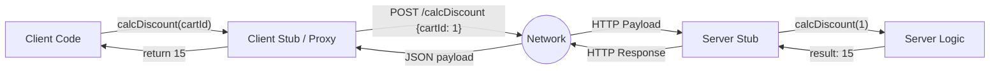

# RPC (Remote Procedure Call)

Remote Procedure Call (Удаленный вызов процедур) — это концепция, при которой клиент вызывает функцию на удаленном сервере так, как если бы она была локальной функцией в самом приложении. В отличие от REST, который сфокусирован на "Сущностях" (Ресурсах), RPC сфокусирован на "Действиях" (Методах).

Боль, которую решает RPC — это семантический разрыв между кодом и сетью. Во многих бизнес-процессах трудно натянуть сову на глобус REST. Как, например, выразить в REST процесс "Пересчитать скидку в корзине с учетом промокода"? Можно придумать ресурс, но проще и логичнее сделать `calculateDiscount(cartId, promoCode)`.



### Как это работает на практике
В современном frontend мире популярны типизированные реализации RPC поверх HTTP/JSON. Самые известные примеры — tRPC, Hono RPC, или gRPC-Web (с Protobuf).
На сервере мы экспортируем роутер с функциями, а на клиенте через магию TypeScript мы получаем автокомплит и полную проверку типов (End-to-End Type Safety), даже не генерируя промежуточные OpenAPI схемы.

### Пример кода (Правильное решение)
Использование tRPC для создания монолитного фуллстек-приложения.
```typescript
// 1. Backend (tRPC Router)
export const appRouter = t.router({
  getUser: t.procedure.input(z.string()).query(({ input }) => {
    return { id: input, name: 'Alice' }; // TypeScript знает, что это вернет { id: string, name: string }
  }),
});
export type AppRouter = typeof appRouter;

// 2. Frontend (tRPC Client)
// Клиент импортирует ТОЛЬКО типы, не сам код бекенда
import type { AppRouter } from './server/router';

const user = await trpc.getUser.query("123"); 
// IDE подскажет user.name, а при попытке передать число (вместо string) покажет ошибку
```

### Неочевидные нюансы и границы применимости
1. **Высокая связность (High Coupling)**: RPC (особенно tRPC) плотно связывает клиента и сервер. Это идеально для монорепозиториев (Frontend + Backend на TypeScript), но плохо для публичных API, где клиент и сервер разрабатываются разными командами на разных языках.
2. **Кеширование**: Поскольку действия в RPC часто маппятся на `POST` запросы к единому эндпоинту (или сложным URL), стандартное HTTP-кеширование на уровне CDN/браузера работает хуже, чем в классическом REST.
3. **RPC ≠ JSON-RPC**: Термин RPC очень широкий. Это может быть и древний SOAP, и gRPC (бинарный протокол поверх HTTP/2), и tRPC (TypeScript магия поверх обычных fetch).
