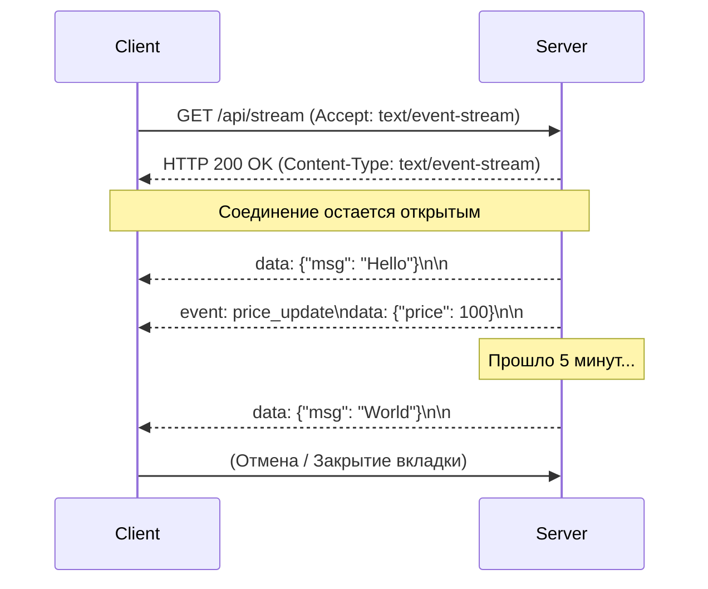

# Server-Sent Events (SSE)

Server-Sent Events — это технология, позволяющая серверу инициировать передачу данных клиенту через единственное долгоживущее HTTP-соединение. В отличие от WebSockets, это **однонаправленный** канал: сервер пушит события, а клиент их только слушает.

Боль, которую мы решаем — необходимость получать обновления от сервера в реальном времени (нотификации, тикеры акций, стриминг ответов от LLM) без дорогостоящего поллинга (когда клиент долбит сервер запросами "есть че новое?") и без оверхеда на установку двунаправленного WebSocket соединения.



### Как это работает на практике
Сервер отдает ответ со специальным заголовком `Content-Type: text/event-stream`. Данные передаются в простом текстовом формате, где каждое сообщение отделяется двумя переносами строк `\n\n`. В браузере мы используем встроенный класс `EventSource` (или `fetch` со стримингом), чтобы подцепиться к этому потоку.

### Пример кода (Правильное решение)
Использование нативного `EventSource` во фронтенде:
```typescript
function useLiveNotifications() {
  const [notifications, setNotifications] = useState([]);

  useEffect(() => {
    // Открываем соединение
    const sse = new EventSource('/api/notifications');

    // Слушаем кастомные события
    sse.addEventListener('NEW_MESSAGE', (e) => {
      const data = JSON.parse(e.data);
      setNotifications(prev => [...prev, data]);
    });

    // Обработка ошибок (EventSource автоматически попытается переподключиться!)
    sse.onerror = (err) => console.error("SSE Error:", err);

    // Очистка при размонтировании
    return () => sse.close();
  }, []);

  return notifications;
}
```

### Неочевидные нюансы и границы применимости
1. **Лимит соединений в HTTP/1.1**: Браузеры (особенно старые) ограничивают количество одновременных HTTP/1.1 подключений к одному домену (обычно 6). Если открыть 6 вкладок с SSE, 7-я вкладка просто зависнет. Проблема уходит при использовании HTTP/2 (мультиплексирование).
2. **Встроенный Reconnect**: Главная филлер-фича `EventSource` — он автоматически восстанавливает соединение при обрыве связи и даже отправляет заголовок `Last-Event-ID`, чтобы сервер знал, с какого места продолжить стриминг.
3. **Ограничения `EventSource`**: Нативный API не позволяет передавать кастомные заголовки (например, `Authorization: Bearer token`). Приходится передавать токен в URL (что небезопасно) или использовать кастомные полифиллы на базе `fetch()`, которые читают `ReadableStream`.
