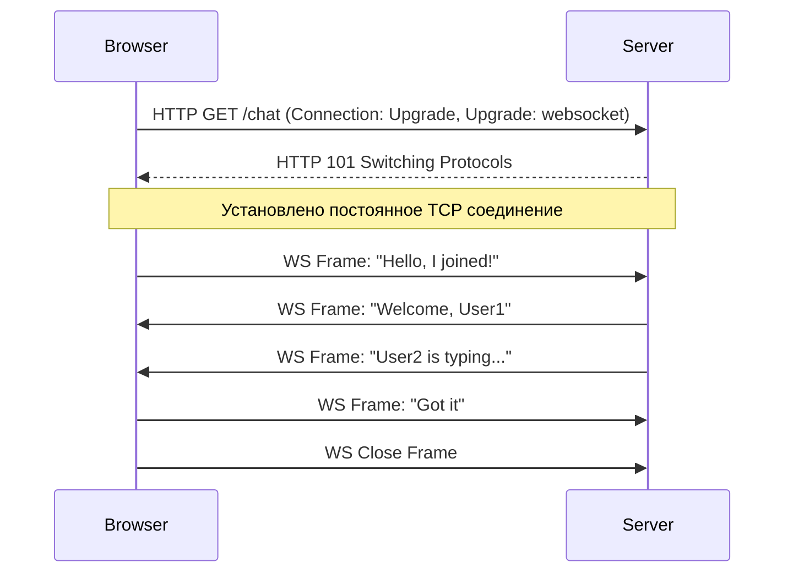

# WebSocket

WebSocket — это протокол полнодуплексной (двунаправленной) связи поверх одного TCP-соединения. В отличие от HTTP (где клиент всегда первым делает запрос), с WebSocket и клиент, и сервер могут отправлять сообщения друг другу в любой момент.

Боль, которую мы решаем: необходимость мгновенного (real-time) двустороннего обмена данными. Например, в чатах, многопользовательских играх, совместном редактировании документов (Figma, Google Docs), где нужно отправлять свои действия и моментально получать действия других пользователей.



### Как это работает на практике
Соединение начинается как обычный HTTP-запрос (Handshake), а затем "апгрейдится" до WebSocket. После этого данные передаются "фреймами" без тяжелых HTTP-заголовков. Часто поверх WebSocket используют высокоуровневые библиотеки (Socket.io, SignalR), которые добавляют переподключение, комнаты (rooms/channels) и фоллбеки (на long polling, если WS заблокирован фаерволом).

### Пример кода (Антипаттерн vs Правильное решение)
**Антипаттерн**: Использование нативного WebSocket без обработки разрывов.
```javascript
const ws = new WebSocket('wss://api.example.com');
ws.onmessage = (e) => setMessages([...messages, e.data]);
// Если пользователь уехал в туннель и интернет пропал на 5 секунд, 
// соединение умрет (закроется с кодом 1006) и больше никогда не восстановится.
```

**Правильное решение**: Использование абстракций с реконнектом и Heartbeat-механизмами.
```javascript
import useWebSocket from 'react-use-websocket';

function Chat() {
  const { sendMessage, lastMessage } = useWebSocket('wss://api.example.com', {
    shouldReconnect: (closeEvent) => true, // Автоматический реконнект
    heartbeat: {
      message: 'ping',
      returnMessage: 'pong',
      timeout: 60000, // Если нет ответа минуту - пересоздаем сокет
    }
  });
}
```

### Неочевидные нюансы и трейдоффы
1. **Sticky Sessions (Прилипание)**: Если ваш бекенд отмасштабирован (несколько инстансов), WebSocket-соединение привязывается к конкретному серверу (stateful). Вам нужно настраивать Redis Pub/Sub, чтобы сервера могли общаться между собой, или использовать сервисы вроде Socket.io Redis Adapter.
2. **Балансировка нагрузки**: Обычные балансировщики (Load Balancers) могут разрывать долгоживущие бездействующие соединения. Необходимы пинги (Heartbeats / Keep-Alive) на уровне приложения.
3. **Отсутствие стандартизации**: WebSocket передает просто строки или блобы. В отличие от REST (где есть URL и методы), в WS вам придется придумывать собственный формат сообщений (например, `{ type: 'JOIN', payload: { roomId: 123 } }`).
