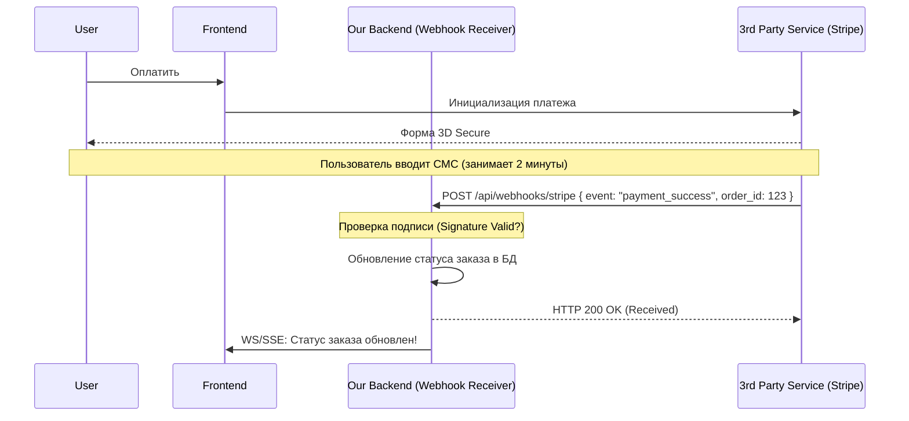

# Webhooks

Webhook (веб-хук) — это механизм, с помощью которого одно приложение может уведомить другое приложение о событии в реальном времени посредством HTTP POST запроса. Фактически, это "User-defined HTTP callbacks".

Боль, которую мы решаем: отсутствие необходимости постоянно "опрашивать" (poll) сторонний сервис. Например, когда пользователь оплачивает заказ в Stripe, деньги могут списываться несколько минут. Вместо того чтобы наш бекенд (или фронтенд) каждую секунду спрашивал Stripe: "Оплатил? Оплатил?", Stripe сам делает HTTP-запрос на наш сервер, когда оплата пройдет.



### Как это работает на практике
Во фронтенд-разработке Webhooks не принимаются напрямую (браузер не имеет публичного IP и не может принимать входящие HTTP-запросы). Вся магия происходит на нашем бекенде, который предоставляет публичный URL (например, `https://api.oursite.com/webhooks/github`). Когда происходит событие, сторонний сервис шлет туда payload. Затем бекенд, в свою очередь, уведомляет фронтенд через WebSockets или SSE.

### Пример (Правильное архитектурное решение)
Комбинирование Webhooks и Polling как fallback на фронтенде:
```typescript
function PaymentStatus() {
  const [status, setStatus] = useState('pending');

  useEffect(() => {
    // 1. Подписываемся на обновления (бекенд пнет нас, когда придет вебхук от Stripe)
    const sse = new EventSource('/api/order-updates');
    sse.onmessage = (e) => setStatus(e.data.status);

    // 2. Fallback: Вдруг вебхук потерялся (Stripe упал/сеть моргнула)?
    // Раз в 10 секунд всё равно проверяем статус обычным REST запросом
    const interval = setInterval(async () => {
      const res = await fetch('/api/orders/current');
      const data = await res.json();
      if (data.status === 'success') {
         setStatus('success');
         clearInterval(interval);
      }
    }, 10000);

    return () => { sse.close(); clearInterval(interval); };
  }, []);
}
```

### Неочевидные нюансы и границы применимости
1. **Безопасность (Подделка хуков)**: Любой человек может отправить POST на ваш Webhook URL. Сторонние сервисы всегда подписывают свои запросы (например, через заголовок `X-Signature`, созданный с помощью HMAC-SHA256). Бекенд обязан проверять эту подпись.
2. **Гарантия доставки (At-least-once)**: Хорошие сервисы пытаются отправить хук повторно (с экспоненциальной задержкой), если ваш сервер ответил 500 или упал по таймауту. Это значит, что один и тот же вебхук может прийти *несколько раз*. Обработчики на бекенде должны быть идемпотентны.
3. **Локальная разработка**: Чтобы тестировать вебхуки на localhost, нужны утилиты для проброса туннелей (например, `ngrok` или `localtunnel`), иначе сторонний сервис не достучится до вашего запущенного на `localhost:3000` сервера.
