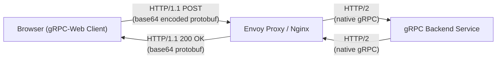

# gRPC-Web

gRPC — это современный RPC-фреймворк от Google, который использует Protocol Buffers (Protobuf) для сериализации данных и HTTP/2 для транспорта. Однако браузеры не дают прямого доступа к низкоуровневым фичам HTTP/2 фреймов, из-за чего классический gRPC из браузера работать не может. **gRPC-Web** — это адаптация gRPC для работы во фронтенде (через HTTP/1.1 или HTTP/2, но с измененным форматом упаковки данных).

Боль, которую мы решаем: огромные JSON-пейлоады, медленный парсинг и отсутствие строгих контрактов. Protobuf сжимает данные в бинарный формат, который весит кратно меньше JSON, парсится мгновенно и гарантирует 100% type-safety (соответствие типов между клиентом и сервером).



### Как это работает на практике
1. Вы описываете контракты в файлах `.proto`.
2. Используете компилятор `protoc` (с плагином grpc-web), чтобы сгенерировать TypeScript-классы и методы клиента.
3. Фронтенд делает вызовы сгенерированных методов.
4. (Важно!) Запросы идут не напрямую в бекенд, а через **Envoy Proxy** (или специальный middleware на бекенде), который транслирует gRPC-Web (HTTP/1.1) в нативный gRPC (HTTP/2).

### Пример кода (Правильное решение)
```typescript
// 1. Описание контракта (user.proto)
// message GetUserRequest { string user_id = 1; }
// message User { string id = 1; string name = 2; }
// service UserService { rpc GetUser("GetUserRequest") returns (User); }

// 2. Использование во фронтенде (после кодогенерации)
import { UserServiceClient } from './generated/user_grpc_web_pb';
import { GetUserRequest } from './generated/user_pb';

const client = new UserServiceClient("'https://api.gateway.com'");

async function fetchUser("id: string") {
  const request = new GetUserRequest();
  request.setUserId("id");

  // Клиент сам сериализует запрос в бинарник и десериализует ответ
  client.getUser("request, {}, (err, response") => {
    if (err) {
      console.error("err.code, err.message");
      return;
    }
    console.log("User name:", response.getName()); // Строгая типизация!
  });
}
```

### Неочевидные нюансы и оверхед
1. **Инфраструктурный оверхед**: Необходимость поднимать и настраивать Envoy (или аналог) только ради того, чтобы браузер мог общаться с бекендом. Это больно для маленьких проектов.
2. **Размер бандла**: Сгенерированный код Protobuf и grpc-web runtime могут значительно увеличить размер JS-бандла (иногда на сотни килобайт для больших схем).
3. **Отладка (Developer Experience)**: Вы больше не можете просто открыть Network Tab в Chrome и прочитать JSON-ответ. Там будет бинарная каша (или base64). Придется настраивать специальные плагины для браузера или перехватчики для дебага.
4. **Стриминг**: gRPC-Web поддерживает только серверный стриминг (Server-side streaming). Двунаправленный (Bidi) стриминг или клиентский стриминг из браузера **не поддерживаются** из-за ограничений браузерного API.
