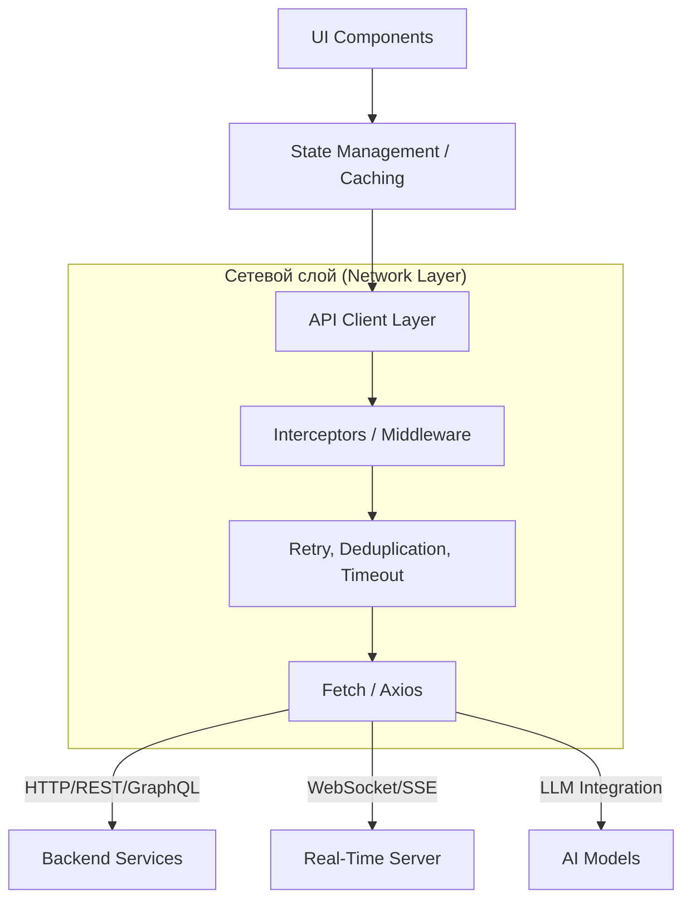

# Архитектура API, Сетевой слой и Интеграции

В современной frontend-разработке мы больше не просто «красим кнопки». Клиентское приложение стало сложной распределённой системой, которая активно взаимодействует с десятками микросервисов, сторонних API и даже AI-моделями. 

Боль, которую мы здесь решаем — это хрупкость сетевого взаимодействия. Сеть ненадёжна: пакеты теряются, сервера падают, таймауты срабатывают в самый неподходящий момент, а пользователи едут в метро с прерывающимся Edge-интернетом. Если frontend не умеет это корректно обрабатывать, приложение превращается в тыкву.

Данный раздел посвящен тому, как выстроить пуленепробиваемый сетевой слой, который изолирует UI от проблем с сетью, как грамотно проектировать контракты с backend-ом и как интегрироваться с современными AI-инструментами.



### Архитектурные принципы
1. **Изоляция сети от UI**: Компоненты ничего не знают про HTTP, они дергают методы репозиториев или мутации.
2. **Fail-safe by design**: Каждый запрос должен иметь таймаут, обработку ошибок и, возможно, retry-политику.
3. **Строгие контракты**: Данные с бекенда (DTO) должны валидироваться и маппиться в доменные модели клиента.

### Антипаттерн
Вызов `fetch` прямо в `useEffect` компонента без обработки гонки данных (race conditions), отмен запросов и маппинга:
```tsx
function BadProfile() {
  const [data, setData] = useState(null);
  useEffect(() => {
    // Нет отмены (AbortController), нет обработки ошибок
    fetch('/api/profile').then(r => r.json()).then(setData);
  }, []);
  // ...
}
```

### Правильное решение
Делегирование этих задач специализированным слоям (API Client, React Query/SWR) и использование строгих контрактов (OpenAPI, GraphQL).
