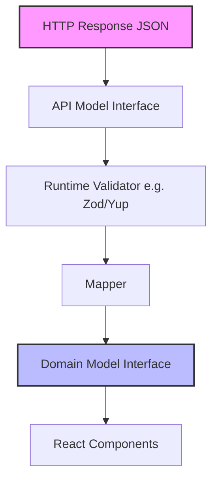

# API Models

API Models (Модели API) — это структуры данных, которые описывают форму (shape) запросов и ответов при взаимодействии с сервером. Во фронтенде они выполняют роль границы (boundary) между внешним непредсказуемым миром (сетью) и внутренней строго типизированной бизнес-логикой приложения.

Боль, которую мы решаем: "AnyType-ориентированное программирование". Когда разработчик делает `fetch('/api/users').then(r => r.json())` и получает `any`, он теряет всю мощь TypeScript. Одно изменение поля на бекенде (например, `userName` вместо `name`) ломает фронтенд в рантайме, и узнаем мы об этом только от злых пользователей.



### Как это работает на практике
API модели обычно представляют собой просто TypeScript интерфейсы (`interface UserApiResponse`). Важно понимать, что API Модель **не равна** Доменной Модели. API модель отражает структуру БД бекенда (со змеиным регистром `created_at`, странными флагами и нормализованными связями по ID). 

### Пример кода (Антипаттерн vs Правильный подход)

**Антипаттерн**: Использование API модели прямо в UI компонентах.
```typescript
interface UserAPI {
  first_name: string;
  is_del: boolean; // Странный флаг из легаси БД
}

function UserCard({ user }: { user: UserAPI }) {
  if (user.is_del) return null;
  return <div>{user.first_name}</div>;
}
```

**Правильное решение**: Жесткое разделение API и Domain.
```typescript
// 1. API Model (то, что пришло по сети)
interface UserApiResponse {
  id: number;
  first_name: string;
  is_del: boolean;
}

// 2. Domain Model (то, с чем удобно работать фронтенду)
interface User {
  id: string; // Фронтенд предпочитает строковые ID
  name: string;
  isDeleted: boolean;
}

// 3. Mapper (переходник)
const mapUserToDomain = (dto: UserApiResponse): User => ({
  id: String(dto.id),
  name: dto.first_name,
  isDeleted: dto.is_del,
});
```

### Неочевидные нюансы и трейдоффы
1. **Дублирование кода**: Создание отдельных API и Domain моделей кажется избыточным (boilerplate), особенно на стартап-стадии. Зачастую разработчики скрепя зубами используют API-модели везде, что в итоге приводит к размазыванию логики адаптации (например, конвертации дат из строк в `Date`) по всему UI.
2. **TypeScript ложь (Compile-time vs Run-time)**: Интерфейс в TypeScript существует только на этапе компиляции. Если бекенд вернет `{ "firstName": "John" }` вместо `{ "first_name": "John" }`, TypeScript вас не спасет, приложение упадет. Для надежности API модели нужно валидировать в рантайме (см. паттерн Runtime Validation).
