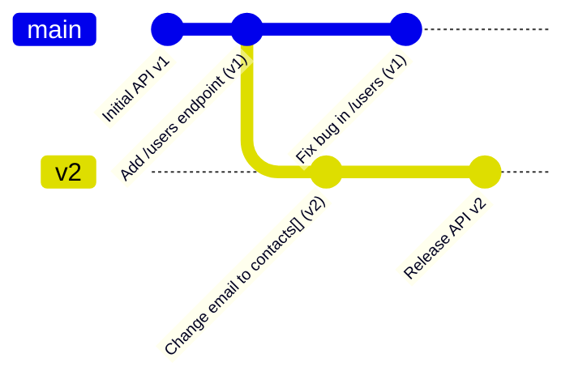

# API Versioning (Версионирование API)

Версионирование API — это практика управления изменениями в контрактах между клиентом и сервером. Как только ваше приложение уходит в продакшен, вы теряете контроль над тем, когда пользователи обновят свои клиенты (особенно мобильные приложения или закешированные PWA). 

Боль, которую мы решаем: "Breaking Changes" (ломающие изменения). Бекендер решил удалить поле `email` из ответа и заменить его на массив `contacts`. Если не использовать версионирование, старые клиенты, ожидающие `email` как строку, мгновенно упадут с `TypeError: Cannot read properties of undefined`.



### Как это работает на практике
Бекенд поддерживает сразу несколько версий одного и того же эндпоинта. Существует три основных подхода:
1. **URI Versioning**: `https://api.example.com/v1/users` (самый популярный и кэшируемый подход).
2. **Header Versioning**: Передача версии в заголовке, например `Accept: application/vnd.myname.v1+json` или `X-API-Version: 1`.
3. **Query Parameter**: `https://api.example.com/users?version=1`.

### Пример (Правильная архитектура фронтенда)
Фронтенд должен инкапсулировать версию внутри сетевого слоя (API Client), чтобы бизнес-логика ничего о ней не знала.

```typescript
// api/client.ts
const apiClientV1 = axios.create({ baseURL: 'https://api.mysite.com/v1' });
const apiClientV2 = axios.create({ baseURL: 'https://api.mysite.com/v2' });

// api/users.ts
// Временно используем V2 для новой фичи, пока остальной апп на V1
export const fetchUserContacts = async (id: string) => {
  const { data } = await apiClientV2.get(`/users/${id}/contacts`);
  return data;
};

export const fetchUserProfile = async (id: string) => {
  const { data } = await apiClientV1.get(`/users/${id}`);
  return data;
};
```

### Неочевидные нюансы и границы применимости
1. **Боль бекенда**: Поддержка нескольких версий API на сервере — это ад. Приходится дублировать контроллеры, писать адаптеры или держать старые таблицы в БД. Поэтому бекендеры будут сопротивляться версионированию до последнего, заставляя фронтенд писать защитный код (`if (data.email) ... else if (data.contacts) ...`).
2. **GraphQL Evolution**: Создатели GraphQL заявляют, что версионирование в GraphQL не нужно. Вместо версий `/v2/` они предлагают паттерн **Schema Evolution**: старые поля помечаются директивой `@deprecated`, а новые добавляются рядом. Старые клиенты продолжают запрашивать старые поля, новые — новые.
3. **Sunset (Депрекация)**: Версии не могут жить вечно. Сервер должен отправлять заголовок `Sunset` (RFC 8594), чтобы сообщить фронтенду дату отключения v1. Фронтенд может перехватывать этот заголовок и показывать пользователю плашку "Пожалуйста, обновите приложение".
