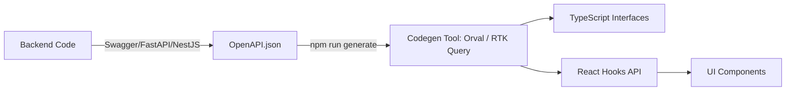

# Code Generation (Кодогенерация)

Кодогенерация API-слоя — это процесс автоматического создания TypeScript-типов, интерфейсов, DTO и даже готовых хуков (`useQuery` / `useMutation`) на основе машиночитаемой схемы контракта (OpenAPI/Swagger, GraphQL Schema или tRPC роутера).

Боль, которую мы решаем — рутинный ручной труд и рассинхронизация. Раньше фронтендер открывал Swagger UI глазами, копировал структуру JSON и вручную писал `interface UserResponse { ... }`. Стоит бекендеру изменить тип поля, фронтендер об этом не узнает, пока код не упадет в проде. Кодогенерация делает API строго типизированным на 100% автоматически.



### Как это работает на практике
В проект добавляется скрипт (например, инструмент `Orval`, `openapi-typescript-codegen` или `graphql-codegen`). Во время сборки (или вручную перед коммитом) скрипт скачивает свежий `schema.json` с бекенда и генерирует папку `/api/generated/`.

### Пример (Правильное решение)
Использование инструмента **Orval** (генерация React Query хуков из OpenAPI).

1. Конфиг `orval.config.js`:
```javascript
module.exports = {
  api: {
    input: 'https://api.example.com/swagger.json',
    output: {
      mode: 'tags-split',
      target: 'src/api/generated',
      client: 'react-query', // Генерируем не просто типы, а сразу useQuery!
    },
  },
};
```
2. В компоненте мы просто импортируем готовый хук:
```tsx
import { useGetUserById } from '../api/generated/users';

function UserProfile({ id }) {
  // data уже имеет правильный тип UserResponse!
  const { data, isLoading } = useGetUserById(id);
  
  if (isLoading) return <Spinner />;
  return <div>{data.firstName}</div>;
}
```

### Неочевидные нюансы и трейдоффы
1. **Мусор в сгенерированном коде**: Если бекендеры пишут неаккуратный Swagger (плохие названия, отсутствие тегов, дубликаты моделей), вы получите ужасный сгенерированный код на клиенте (например хук `useApiV1UsersGet2`). Кодогенерация работает только если бекенд дисциплинирован.
2. **Merge Conflicts**: Сгенерированные файлы часто вызывают конфликты при мерже веток в Git. Решение: либо не коммитить их вообще (генерировать на CI и pre-start), либо выносить в отдельный внутренний NPM-пакет.
3. **Проблемы с кастомной логикой**: Если вам нужно перехватить запрос (добавить токен) или смаппить данные (из API Model в Domain Model), вам нельзя править сгенерированный файл (он перезапишется). Приходится использовать middleware/interceptors на уровне HTTP-клиента (Axios).
