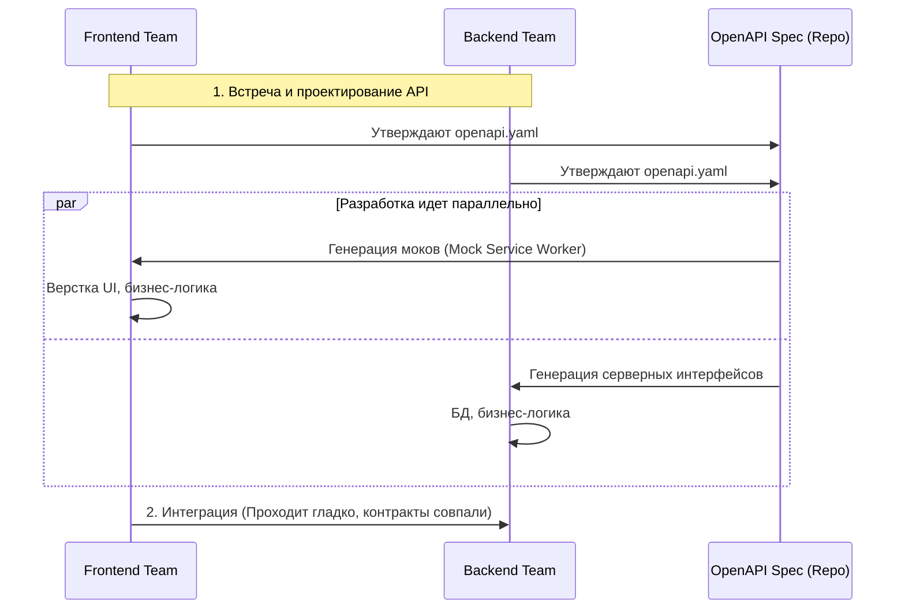

# Contract First (Сначала контракт)

Contract First (или API-First Design) — это методология разработки, при которой команды фронтенда и бекенда договариваются о структуре API (пишут контракт/схему) **до** написания единой строчки кода бизнес-логики.

Боль, которую мы решаем — блокировка команд (Waterfall). В традиционном подходе (Code First) фронтенд сидит и ждет неделями, пока бекенд спроектирует базу данных, напишет логику и выкатит эндпоинты, чтобы фронтенд мог начать интегрировать UI. Contract First распараллеливает эту работу.



### Как это работает на практике
1. Аналитик или лиды команд садятся и пишут `openapi.yaml` (или GraphQL Schema).
2. Описываются все эндпоинты, типы, обязательные поля и примеры ответов (`examples`).
3. Фронтенд натравливает на этот файл инструменты мокирования (например, MSW - Mock Service Worker или Prism от Stoplight). Фронтенд разрабатывает фичу так, будто бекенд уже готов.
4. Бекенд пишет код, который обязан соответствовать утвержденному контракту (валидация схемы в CI/CD).

### Пример (Антипаттерн vs Правильное решение)

**Антипаттерн (Code First)**: Бекендер пишет код на Spring Boot, вешает аннотации `@RestController`, генерирует Swagger из кода и кидает ссылку фронтендеру с текстом: "Я тут поменял структуру, адаптируйся".

**Правильное решение (Contract First)**: 
```yaml
# Изменение начинается с Pull Request-а в репозиторий с контрактами
paths:
  /users/{id}:
    get:
      summary: Получить профиль
      responses:
        '200':
          content:
            application/json:
              schema:
                $ref: '#/components/schemas/User'
              examples:
                success:
                  value: { "id": "1", "name": "John" } # Мок для фронтенда!
```

### Неочевидные нюансы и границы применимости
1. **Замедление старта**: Написать хорошую схему в YAML руками — это больно и долго. Для стартапов, где требования меняются по 5 раз в день, Contract First может стать бюрократическим адом.
2. **Синхронизация**: Часто контракт пишут в начале спринта, а потом бекендер в процессе реализации понимает, что какую-то связь из БД достать слишком дорого, и втихаря меняет код. Если процесс валидации кода об контракт на сервере не настроен (например через Dredd или Spectral), смысл Contract First полностью теряется.
3. **Инструментарий**: Требует зрелой инфраструктуры (Stoplight, SwaggerHub, MSW, скрипты кодогенерации). Без этого Contract First превращается просто в "документ в Confluence, который никто не читает".
