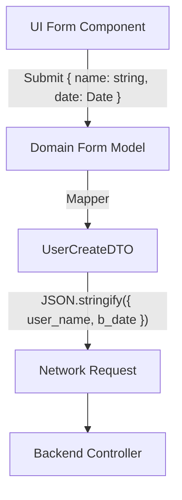

# DTO (Data Transfer Object)

DTO (Объект передачи данных) — это паттерн проектирования, который используется для переноса данных между подсистемами. В контексте фронтенда DTO — это точная структура JSON, которая отправляется на сервер в теле (body) POST/PUT запроса, или та, что приходит от сервера в ответ на GET запрос.

Боль, которую мы решаем — необходимость отделить данные, передаваемые по сети, от бизнес-моделей приложения. Сервер ожидает `birth_date` в формате `YYYY-MM-DD`, а UI-компонент работает с объектом `Date` или `Moment`. Передавать объект `Date` напрямую в `fetch()` нельзя (он сериализуется криво). Нам нужен промежуточный объект — DTO.



### Как это работает на практике
DTO во фронтенде — это исключительно интерфейсы/типы TypeScript. В них **не должно быть методов**, геттеров или сеттеров, только примитивы (строки, числа, булевы значения, массивы), потому что DTO должно безопасно сериализоваться в JSON через `JSON.stringify()`.

### Пример кода (Антипаттерн vs Правильное решение)

**Антипаттерн**: Отправка стейта формы напрямую на бекенд.
```typescript
function onSubmit(formData: FormState) {
  // Упс! Сервер ждал { is_active: boolean }, а мы отправили { isActive: boolean }
  // Упс! Сервер ждал id как number, а из input пришел string.
  fetch('/api/users', { method: 'POST', body: JSON.stringify(formData) });
}
```

**Правильное решение**: Явное создание DTO.
```typescript
// То, что требует сервер (Contract)
interface CreateUserDTO {
  first_name: string;
  is_active: number; // Сервер ждет 0 или 1 (особенности легаси)
}

function onSubmit(formData: FormState) {
  // Маппинг (создание DTO)
  const dto: CreateUserDTO = {
    first_name: formData.firstName,
    is_active: formData.isActive ? 1 : 0,
  };
  
  fetch('/api/users', { method: 'POST', body: JSON.stringify(dto) });
}
```

### Неочевидные нюансы и трейдоффы
1. **Префикс/Суффикс DTO**: В некоторых командах принято добавлять суффикс `Dto` ко всем сетевым типам (`UserDto`, `CreateOrderDto`), чтобы визуально отличать их от доменных моделей (`User`, `Order`).
2. **DTO vs API Models**: В мире фронтенда эти термины часто используются как синонимы. Технически, DTO — это паттерн, а API Model — его реализация.
3. **Anemic Domain Model (Анемичная модель)**: Если ваши Доменные Модели в точности повторяют ваши DTO, и в них нет никакой логики (только поля) — это антипаттерн анемичной модели. Вы зря пишете мапперы, если структуры идентичны и не планируют меняться. В простых CRUD-приложениях маппинг DTO в Domain можно пропустить.
