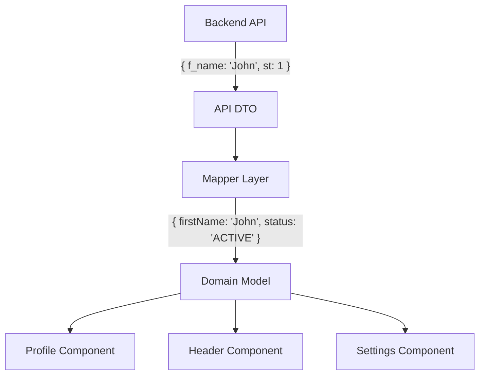

# Domain Models (Доменные модели)

Доменная модель (в контексте Фронтенд-архитектуры) — это структура данных (или класс/объект), которая идеально отражает предметную область (бизнес-логику) и удобна для использования непосредственно в UI-компонентах. Это "очищенные" данные.

Боль, которую мы решаем: размазывание "грязной" логики парсинга и адаптации серверных ответов по всему приложению. Если сервер присылает `status: 1` (где 1 — это "Активен"), и вы используете это напрямую в компонентах, то по всему коду будут рассыпаны магические проверки `if (user.status === 1)`. Доменная модель переводит это в `user.isActive: boolean`.



### Как это работает на практике
Доменная модель всегда пишется так, чтобы компонентам было максимально удобно ее рендерить. 
- Даты — это объекты `Date` или готовые отформатированные строки (если форматирование не зависит от локали компонента).
- Идентификаторы — всегда `string` (даже если на сервере это `number`).
- Флаги — всегда `boolean`.
- Магические числа заменяются на Enum или Union типы (`'ACTIVE' | 'BANNED'`).

### Пример кода (Антипаттерн vs Правильное решение)

**Антипаттерн**: "Грязные" данные из сети текут в UI.
```tsx
function UserStatus({ user }: { user: UserDTO }) {
  // UI должен знать, что 1 - это активно, 2 - забанено. Ужас!
  const color = user.st === 1 ? 'green' : 'red';
  const label = user.st === 1 ? 'Active' : 'Banned';
  return <Badge color={color}>{label}</Badge>;
}
```

**Правильное решение**: Компонент глуп и работает с доменной моделью.
```tsx
// 1. Доменная модель
interface User {
  id: string;
  name: string;
  isBanned: boolean; // Очищенный флаг
}

// 2. Глупый компонент
function UserStatus({ user }: { user: User }) {
  // Никакой магии, только UI логика
  return <Badge color={user.isBanned ? 'red' : 'green'}>
    {user.isBanned ? 'Banned' : 'Active'}
  </Badge>;
}
```

### Неочевидные нюансы и трейдоффы
1. **Где живут методы?** В ООП доменная модель — это класс с методами (`user.ban()`). В современном React (функциональном) доменные модели — это просто TypeScript-интерфейсы (Plain Objects), а "методы" выносятся в кастомные хуки (`useBanUser()`) или Thunks/Sagas.
2. **Оверхед на маппинг**: В 80% случаев DTO и Domain Model совпадают. Создавать маппер, который делает `return { name: dto.name }`, кажется глупым. В таких случаях можно использовать DTO напрямую в UI, но как только контракт сервера начнет расходиться с нуждами UI, нужно немедленно вводить Доменную модель.
3. **Хрупкость UI**: Если вы не используете Доменные Модели, то при изменении формата ответа на сервере (например, сервер стал возвращать статус строкой вместо числа), вам придется рефакторить десятки компонентов. С Доменной Моделью вы меняете только одну функцию-маппер.
