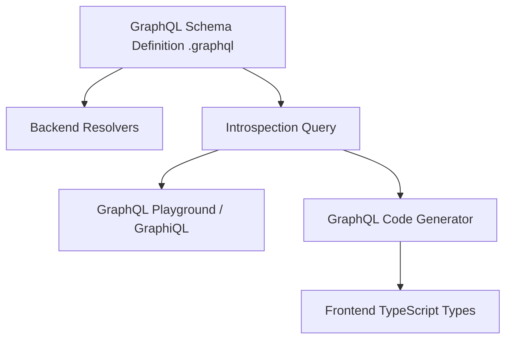

# GraphQL Schema

GraphQL Schema (Схема GraphQL) — это строго типизированный контракт между клиентом и сервером. В отличие от REST, где контракты опциональны (Swagger), в GraphQL схема встроена в саму суть протокола. Сервер физически не запустится, если схема невалидна, а клиент не сможет сделать запрос к полю, которого нет в схеме.

Боль, которую мы решаем — гадание на кофейной гуще. Фронтендеру не нужно открывать Postman, дергать эндпоинт и смотреть, какие поля вернулись. Схема является "самодокументируемой" (Introspection API) и предоставляет 100% покрытие типами.



### Как это работает на практике
Схема пишется на специальном языке SDL (Schema Definition Language). Она состоит из трех корневых типов: `Query` (чтение), `Mutation` (изменение) и `Subscription` (вебсокеты/риэлтайм).
Фронтенд-инструменты скачивают эту схему (через Introspection запрос к серверу) и генерируют TypeScript-типы для всех возможных запросов.

### Пример (Schema и Frontend код)

**1. Схема на сервере (SDL)**
```graphql
type User {
  id: ID!         # Знак ! означает обязательное поле (non-null)
  name: String!
  avatar: String  # Может быть null
}

type Query {
  getUser(id: ID!): User
}
```

**2. Запрос на клиенте**
```graphql
query FetchProfile($id: ID!) {
  getUser(id: $id) {
    name
    # Если мы случайно напишем email (которого нет в схеме), 
    # IDE подсветит ошибку еще до запуска кода!
  }
}
```

### Неочевидные нюансы и трейдоффы
1. **Nullability по умолчанию**: В GraphQL все поля по умолчанию могут вернуть `null`, если не указан `!`. Из-за этого сгенерированные TypeScript-типы часто пестрят `string | null | undefined`, заставляя фронтендера писать бесконечные опциональные цепочки (`user?.name`). Бекендеры часто забывают ставить `!`.
2. **Schema Stitching / Federation**: В микросервисной архитектуре у вас может быть 5 разных сервисов со своими схемами. Использовать их с фронтенда напрямую неудобно. Для этого используется Apollo Federation — единый шлюз (Gateway), который склеивает схемы микросервисов в одну гигантскую Супер-Схему (Supergraph) для фронтенда.
3. **Introspection в Проде**: Обычно серверы отключают возможность скачивать схему (Introspection) на Production-окружении из соображений безопасности (чтобы хакеры не изучили API). Поэтому фронтенд-кодогенератор должен ходить за схемой на Staging или Dev-сервер.
