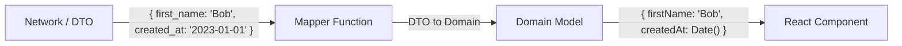

# Mapping (Маппинг данных)

Маппинг (или Трансляция) — это процесс преобразования данных из одного формата (DTO/API Model) в другой (Domain Model/UI Model) и обратно. В архитектуре фронтенда это функция (или класс), которая стоит на границе между сетевым слоем и бизнес-логикой.

Боль, которую мы решаем — несовпадение контрактов (Contract Mismatch). Бекенд и БД развиваются по своим правилам (им важна нормализация, индексы, легаси-структуры), а UI развивается по своим правилам (нам важна удобная отрисовка). Если заставлять UI работать со структурами БД, компоненты превратятся в кашу из проверок и преобразований.



### Как это работает на практике
Маппер — это обычно чистая функция (Pure Function). Она принимает объект одного типа и возвращает объект другого типа. В сложных системах мапперы могут агрегировать данные из нескольких DTO в одну доменную модель или наоборот.

### Пример кода (Правильное решение)

```typescript
// DTO из сети
interface ApiUser {
  id: number;
  f_name: string;
  l_name: string;
  role_id: number;
}

// Доменная модель
interface User {
  id: string;
  fullName: string;
  isAdmin: boolean;
}

// Mapper-функция
export const mapUserToDomain = (dto: ApiUser): User => {
  return {
    id: dto.id.toString(), // Приводим к строке для консистентности
    fullName: `${dto.f_name} ${dto.l_name}`.trim(), // Склеиваем имя для UI
    isAdmin: dto.role_id === 99, // Скрываем магическое число "99" внутри маппера
  };
};

// Использование в API-клиенте
const fetchUser = async (id: number): Promise<User> => {
  const { data } = await api.get<ApiUser>(`/users/${id}`);
  return mapUserToDomain(data); 
  // UI получит уже идеальную модель!
};
```

### Неочевидные нюансы и трейдоффы
1. **Где должен лежать маппинг?** Самая частая ошибка — вызывать функцию маппинга внутри компонента. Это плохо, потому что хуки данных (`useQuery` или Redux Thunks) закешируют DTO, а маппинг будет выполняться при каждом рендере. Правильно: маппить данные **сразу после ответа от fetch/axios** или в селекторах стора (`selectUser`).
2. **Оверхед на массивах**: Если сервер вернул список из 10,000 элементов, `data.map(mapItemToDomain)` синхронно заблокирует Main Thread браузера. Для больших массивов маппинг нужно оптимизировать (например, маппить только то, что попадает в виртуальный список, или выносить в WebWorker, хотя это редкость).
3. **Двусторонний маппинг**: Не забывайте, что при отправке формы обратно на сервер вам потребуется обратный маппер: `mapDomainToUserDto(user)`. Он должен восстановить змеиный регистр и магические числа для бекенда.
