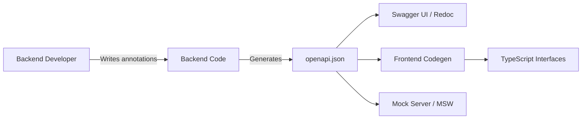

# OpenAPI (Swagger)

OpenAPI (ранее известный как Swagger) — это индустриальный стандарт для описания RESTful API в формате YAML или JSON. Он позволяет людям и компьютерам понимать возможности сервиса без необходимости заглядывать в исходный код.

Боль, которую мы решаем: отсутствие документации и строгих типов в REST. Если бекендер просто пишет эндпоинт в коде, фронтендеру приходится угадывать, какие параметры нужно передать, и что вернется в ответе. OpenAPI предоставляет машиночитаемый "паспорт" для API, на основе которого можно генерировать документацию (Swagger UI), мок-серверы и код клиента.



### Как это работает на практике
Спецификация OpenAPI описывает:
1. Доступные пути (paths) и операции (GET, POST).
2. Параметры ввода и вывода (тело запроса, query-параметры, заголовки).
3. Методы аутентификации (Bearer, OAuth2).
4. Типы данных (Schemas) с использованием подмножества JSON Schema.

### Пример (Фрагмент OpenAPI и использование)
Вот так бекенд описывает контракт:
```yaml
paths:
  /users/{id}:
    get:
      summary: Получить пользователя
      parameters:
        - name: id
          in: path
          required: true
          schema:
            type: integer
      responses:
        '200':
          description: Успех
          content:
            application/json:
              schema:
                $ref: '#/components/schemas/User'
components:
  schemas:
    User:
      type: object
      required: [id, name]
      properties:
        id:
          type: integer
        name:
          type: string
```
А фронтенд, вместо написания типов руками, запускает генератор и получает:
```typescript
export interface User { id: number; name: string; }
export const getUser = (id: number) => fetch(`/users/${id}`);
```

### Неочевидные нюансы и границы применимости
1. **Swagger ≠ OpenAPI**: Исторически формат назывался Swagger (версия 2.0). Начиная с версии 3.0 он был передан в Linux Foundation и переименован в OpenAPI Specification (OAS). Но инструменты (например, Swagger UI) сохранили старое название.
2. **Ложь в контрактах**: Инструменты генерации OpenAPI (например в Spring или NestJS) часто генерируют схему из типов языка бекенда, а не из реальных JSON-ответов. Если бекендер ошибся с аннотацией `@JsonIgnore`, в Swagger поле будет, а в реальном ответе — нет. Доверяй, но валидируй в рантайме.
3. **Размер спецификации**: В крупных проектах `openapi.json` может весить мегабайты. Парсинг такого файла кодогенератором или отображение его в Swagger UI может жестко вешать браузер. В таких случаях схему бьют на микро-спецификации (через `$ref` на внешние файлы).
