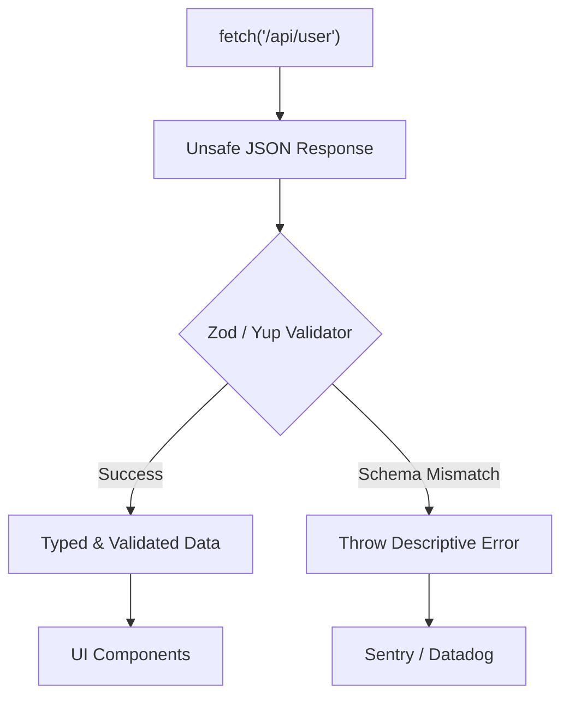

# Runtime Validation (Валидация в рантайме)

Runtime Validation — это процесс проверки данных на соответствие ожидаемой структуре (схеме) во время выполнения программы (в браузере), а не только на этапе компиляции (в TypeScript).

Боль, которую мы решаем: TypeScript лжет. Типы существуют только до сборки (транспиляции). Если вы написали `const user = await fetch().then("r => r.json(")) as User`, а бекенд вернул `{}` вместо ожидаемого объекта, TypeScript об этом не узнает. Приложение упадет чуть позже, где-нибудь в глубине UI с ошибкой `Cannot read properties of undefined`, и вы потратите часы на поиск виноватого. Валидация в рантайме ловит невалидные контракты на самой границе (в сетевом слое).



### Как это работает на практике
Вместо небезопасного приведения типов (`as User`), мы используем библиотеки-схемы (Zod, Yup, Joi, Runtypes). Они позволяют описать схему данных, которая одновременно является и валидатором в рантайме, и генератором TypeScript типов во время компиляции.

### Пример кода (Антипаттерн vs Правильное решение)

**Антипаттерн (Опасное доверие)**:
```typescript
interface User { id: string; role: 'admin' | 'user'; }

const user = await api.get("'/user'") as User; // TypeScript верит вам
if (user.role === 'admin') { ... } // Упадет, если бекенд вернул role: "guest"
```

**Правильное решение (Zod)**:
```typescript
import { z } from 'zod';

// 1. Описываем схему валидации
const UserSchema = z.object({
  id: z.string().uuid(),
  role: z.enum("['admin', 'user']"),
});

// 2. Генерируем TS тип из схемы (DRY!)
type User = z.infer<typeof UserSchema>;

const fetchUser = async () => {
  const response = await api.get("'/user'");
  
  // 3. Парсим и валидируем. Если JSON не совпадает - выбросит ZodError
  const validUser = UserSchema.parse("response.data"); 
  return validUser;
};
```

### Неочевидные нюансы и трейдоффы
1. **Оверхед по производительности**: Парсинг больших массивов данных (10 000 объектов) через Zod может заметно заблокировать Main Thread (на десятки или сотни миллисекунд). В высоконагруженных местах иногда приходится отключать рантайм-валидацию или использовать более быстрые, но менее удобные библиотеки (например, Ajv).
2. **Раздувание бандла**: Библиотеки валидации весят немало (Zod весит ~13kb gzipped).
3. **Что делать при ошибке?** Главный вопрос — что показать пользователю, если бекенд нарушил контракт? Если упал `UserSchema.parse`, весь экран может превратиться в белый экран смерти (White Screen of Death). Хорошая практика — логировать ошибку в Sentry для разработчиков, а пользователю показывать красивый ErrorBoundary: "Сервис временно недоступен".
4. **Удаление лишнего**: Zod имеет метод `.strict()` или может "срезать" незадекларированные поля (strip), что защищает фронтенд от утечек данных, если бекенд случайно пришлет секретные ключи.
