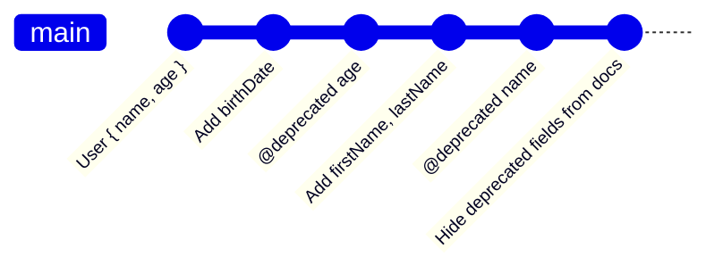

# Schema Evolution (Эволюция схемы)

Schema Evolution (Эволюция схемы) — это подход к изменению контрактов API, при котором схема развивается **только путем добавления** (additive changes). В отличие от классического версионирования (`/v1/`, `/v2/`), где ломающие изменения накапливаются для нового релиза, эволюция схемы требует, чтобы старые клиенты никогда не ломались. Этот подход популяризирован экосистемой GraphQL.

Боль, которую мы решаем: поддержка нескольких мажорных версий API — это ад для бекенда, а принудительное обновление мобильных приложений — это боль для пользователей и бизнеса. Мы хотим развивать API плавно, без "взрывов".



### Как это работает на практике
Правила эволюции схемы очень простые:
1. **Можно**: добавлять новые поля, новые типы, новые эндпоинты.
2. **Можно**: ослаблять требования к входным данным (сделать обязательное поле необязательным).
3. **Нельзя**: удалять поля.
4. **Нельзя**: менять тип существующего поля (например, `id: number` на `id: string`).
5. **Нельзя**: делать существующие необязательные аргументы обязательными.

Старые (устаревшие) поля помечаются как `@deprecated`. Они продолжают работать, но разработчики видят предупреждение в IDE и должны перестать их использовать в новых фичах.

### Пример кода (Антипаттерн vs Правильное решение)

**Антипаттерн (Breaking Change)**:
Бекендер решил, что одно поле `name` — это плохо, и разделил его:
```graphql
# БЫЛО:
type User { name: String! }

# СТАЛО (Старые клиенты упадут, так как они запрашивают name!):
type User { firstName: String!, lastName: String! } 
```

**Правильное решение (Schema Evolution)**:
```graphql
type User {
  # Новые поля
  firstName: String!
  lastName: String!
  
  # Старое поле сохранено, но помечено. 
  # На бекенде оно вычисляется "на лету" как firstName + ' ' + lastName
  name: String! @deprecated(reason: "Use firstName and lastName instead")
}
```

### Неочевидные нюансы и границы применимости
1. **Раздувание кодовой базы**: Со временем схема превращается в кладбище deprecated полей. Бекенд вынужден поддерживать резолверы для этих полей годами (Legacy Hell).
2. **Аналитика использования**: Чтобы безопасно удалить deprecated поле, нужно точно знать, что ни один клиент его больше не запрашивает. Для этого в GraphQL-экосистеме (например, Apollo Studio) есть Field-level Usage Analytics. Если поле не запрашивалось 30 дней — его безопасно удаляют. В REST без специального логирования сделать это невозможно.
3. **Именование**: При эволюции схемы разработчики часто сталкиваются с проблемой нехватки хороших имен (так как старое имя уже занято легаси-полем). Появляются поля вроде `user_new`, `user_v2`, что ухудшает читаемость.
