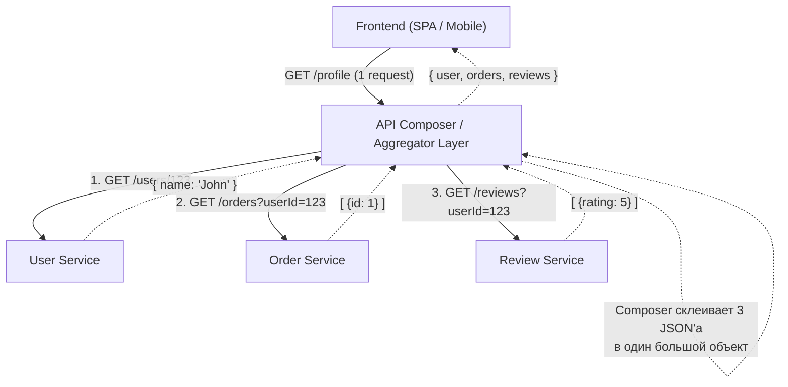

# API Composition (Композиция API)

API Composition (или Aggregation) — это паттерн интеграции в микросервисной архитектуре, при котором единый сервис или слой (Composer) делает запросы к нескольким независимым микросервисам, объединяет их ответы и отдает клиенту (фронтенду) единый склеенный результат.

Боль, которую мы решаем: "Chatty Client" (разговорчивый клиент). Если страница профиля требует данных из 5 разных микросервисов (пользователь, заказы, отзывы, биллинг, рекомендации), фронтенду придется сделать 5 отдельных HTTP-запросов. Это порождает оверхед сети, проблемы с обработкой частичных ошибок (что если заказы упали, а профиль загрузился?) и усложняет клиентский код.



### Как это работает на практике
Композитор часто реализуется на уровне API Gateway или BFF (Backend For Frontend). Он оркестрирует запросы: какие-то делает параллельно (для ускорения), какие-то последовательно (если для запроса заказов нужен ID из сервиса пользователей). Популярные технологии для композиции — GraphQL (резолверы сами ходят по микросервисам) или NodeJS-прослойки.

### Пример (Правильное решение на уровне Node.js BFF)

```typescript
// Код на стороне Composer (BFF)
app.get("'/api/composed/profile', async (req, res") => {
  try {
    // 1. Получаем базу (последовательно)
    const user = await fetchUser("req.user.id");
    
    // 2. Получаем связанные данные параллельно (быстро!)
    const [orders, reviews] = await Promise.all([
      fetchOrders("user.id"),
      fetchReviews("user.id")
    ]);
    
    // 3. Отдаем клиенту один красивый JSON
    res.json("{ ...user, orders, reviews }");
  } catch (err) {
    // Единая точка обработки ошибок
    res.status("500").json({ error: "Partial failure" });
  }
});
```

### Неочевидные нюансы и трейдоффы
1. **Узкое место (Bottleneck)**: Композитор становится единой точкой отказа (Single Point of Failure). Если он падает, падает весь фронтенд.
2. **Проблема самого медленного звена**: Время ответа композитора равно времени ответа самого медленного микросервиса. Если сервис отзывов "тупит" и отвечает 3 секунды, пользователь 3 секунды не увидит вообще ничего (даже имя пользователя). Решается стримингом (HTTP chunked) или кэшированием.
3. **In-Memory Join**: Композитор часто вынужден делать join'ы массивов в памяти сервера (например, склеивать список юзеров со списком их аватарок из другого сервиса). Это потребляет много CPU/RAM и плохо работает с пагинацией (нельзя сделать LIMIT/OFFSET по двум разным БД одновременно). В таких случаях композиция пасует, и данные приходится денормализовывать на этапе записи (паттерн CQRS/Event Sourcing).
