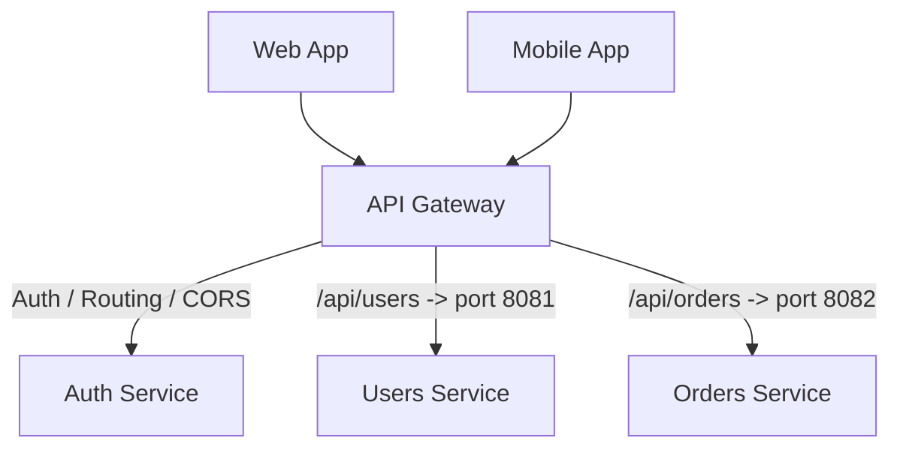

# API Gateway (Шлюз API)

API Gateway — это паттерн архитектуры, представляющий собой единую точку входа (Single Point of Entry) для всех клиентских приложений (веб, мобилки, смарт-ТВ) в систему микросервисов. 

Боль, которую мы решаем: хаос в маршрутизации и безопасности. Если у вас 20 микросервисов, фронтенд не должен знать IP-адреса и порты каждого из них. Фронтенд не должен писать логику ретраев при падении микросервиса. Мы не хотим реализовывать проверку JWT-токена, CORS и Rate Limiting в 20 разных сервисах на 5 разных языках. API Gateway берет эту "грязную" инфраструктурную работу на себя.



### Как это работает на практике
Gateway (часто это Nginx, Kong, AWS API Gateway или Envoy) торчит наружу (public internet), а микросервисы спрятаны во внутренней сети (VPC) и недоступны извне напрямую.
Типичные функции Gateway:
1. **Reverse Routing**: Перенаправление `/api/users/*` в сервис `User`.
2. **SSL Termination**: Расшифровка HTTPS трафика, дальше по внутренней сети данные могут идти по HTTP.
3. **Authentication**: Gateway проверяет JWT токен и пробрасывает внутрь сервисов уже заголовок `X-User-Id: 123`.
4. **Rate Limiting**: Защита от DDoS (не больше 100 запросов в минуту с одного IP).

### Пример (Антипаттерн vs Правильное решение во фронтенде)

**Антипаттерн**: Фронтенд знает про внутреннюю топологию.
```typescript
const fetchUser = () => fetch('https://auth.company.com/api/v1/user');
const fetchOrders = () => fetch('https://billing.company.com/api/v2/orders');
// Если бекендеры решат слить эти два сервиса в один, фронтенд придется переписывать.
```

**Правильное решение**: Фронтенд работает только с Gateway.
```typescript
const api = axios.create({ baseURL: 'https://api.company.com' });
const fetchUser = () => api.get('/users/me');
const fetchOrders = () => api.get('/orders');
// Gateway сам разберется, куда роутить эти запросы.
```

### Неочевидные нюансы и трейдоффы
1. **BFF vs API Gateway**: API Gateway часто путают с BFF (Backend For Frontend). Gateway — это глупая инфраструктурная труба (роутинг, секьюрити). Он не должен менять структуру JSON или склеивать запросы. BFF — это умная прослойка, которая агрегирует данные специально под конкретный UI.
2. **Single Point of Failure**: Если Gateway падает (или кто-то криво обновил конфиг Nginx), ложится всё приложение целиком, даже если все 20 микросервисов работают идеально.
3. **Оверхед на задержку (Latency)**: Любой прыжок через дополнительный узел сети добавляет миллисекунды к задержке. Однако, возможность Gateway терминировать SSL и держать Keep-Alive соединения с сервисами обычно с лихвой окупает этот оверхед.
