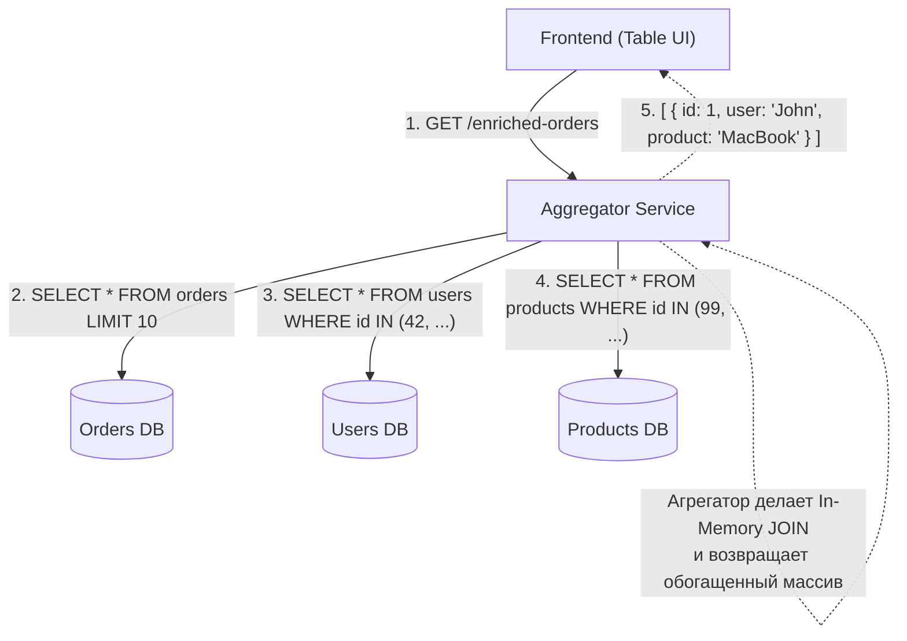

# Aggregator Pattern (Паттерн Агрегатор)

Паттерн Агрегатор — это разновидность композиции (часто реализуемая внутри API Gateway или BFF), главная цель которой — собрать данные из множества слабосвязанных источников в один ответ, чтобы клиенту не приходилось делать N+1 запросов.

Боль, которую мы решаем: проблема N+1 запросов из фронтенда. Допустим, мы показываем таблицу "Последние заказы". Сервер заказов возвращает массив `[{ id: 1, userId: 42, productId: 99 }]`. Чтобы отрисовать таблицу, фронтенду нужны имена юзеров и названия продуктов. Без Агрегатора фронтенд сделает 1 запрос к заказам, а потом `map` и еще 20 параллельных запросов за пользователями и продуктами. Браузер задохнется.



### Как это работает на практике
Агрегатор принимает первоначальный запрос от клиента, определяет, какие базовые данные нужны, затем парсит их, собирает уникальные идентификаторы (например, делает `Set` из `userId`) и отправляет **один батч-запрос** (batch request) к другому микросервису. После получения ответов агрегатор сшивает массивы в памяти (in-memory join) и отдает фронтенду.

### Пример (Правильная реализация в GraphQL или NodeJS)
Популярная утилита для решения этой проблемы — `DataLoader` (от Facebook).
```typescript
// Псевдокод Агрегатора (например на NodeJS BFF)
async function getEnrichedOrders() {
  const orders = await fetch('/internal/orders'); // [{ id: 1, userId: 10 }, { id: 2, userId: 10 }]
  
  // Собираем уникальные ID (чтобы не запрашивать юзера 10 дважды)
  const userIds = [...new Set(orders.map(o => o.userId))]; 
  
  // Делаем ОДИН запрос к сервису юзеров
  const users = await fetch(`/internal/users?ids=${userIds.join(',')}`); 
  const userMap = new Map(users.map(u => [u.id, u]));

  // Обогащаем (Join)
  return orders.map(order => ({
    ...order,
    user: userMap.get(order.userId)
  }));
}
```

### Неочевидные нюансы и трейдоффы
1. **Память Агрегатора**: Выполнение JOIN операций в памяти (NodeJS/Go/Java) требует много RAM. Если массив заказов содержит 100,000 элементов, агрегатор может упасть с Out Of Memory. Агрегация хорошо работает только с пагинированными данными (LIMIT 50).
2. **Сложность сортировки и фильтрации**: Как отсортировать "Заказы" по "Имени пользователя" (по алфавиту), если имя лежит в другой БД? Агрегатор не может запросить из `Orders DB` заказы, отсортированные по полю, которого там нет. Приходится либо выкачивать всё и сортировать в памяти (очень медленно!), либо внедрять CQRS / ElasticSearch, куда будут асинхронно складываться денормализованные "плоские" данные.
3. **Partial Fails (Частичные отказы)**: Что делать агрегатору, если сервис `Users` упал? Вернуть заказы без юзеров (с `user: null`), или вернуть HTTP 500 для всего списка? Это бизнес-решение, которое усложняет логику Агрегатора.
