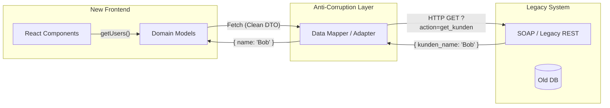

# Anti-Corruption Layer (ACL)

Anti-Corruption Layer (Антикоррупционный слой) — это архитектурный паттерн из Domain-Driven Design (DDD). Его суть — создание изолирующей прослойки между вашей чистой новой системой и "грязной" устаревшей (Legacy) системой. Прослойка транслирует запросы и данные туда-обратно, чтобы семантика старой системы не просачивалась и не "коррумпировала" ваш новый красивый код.

Боль, которую мы решаем: вы пишете новый фронтенд на React/TypeScript, но вынуждены работать со старым SOAP/XML API или кривым REST API 2010-го года, который возвращает ключи на немецком языке (`{ kunden_name: "John" }`) и статусы в виде битовых масок. Если пустить этот ужас напрямую в UI-компоненты, ваш новый проект за месяц превратится в легаси.



### Как это работает на практике
ACL во фронтенде — это не просто функция-маппер. Это целый слой (обычно класс API клиента или набор файлов в `/api/legacy-adapters/`), который:
1. Инкапсулирует кривые URL (`/api/v1/ajax.php?do=users`).
2. Скрывает специфичные заголовки аутентификации.
3. Переводит "птичий" язык легаси в язык вашего домена (например, `is_deleted: "Y"` -> `isActive: false`).

### Пример кода (Правильное решение)

```typescript
// 1. То, с чем хочет работать наш новый фронтенд
interface User {
  id: string;
  name: string;
  isActive: boolean;
}

// 2. ACL (Антикоррупционный слой)
class LegacyUserAdapter {
  static async fetchUser(id: string): Promise<User> {
    // Внутри ACL мы скрываем ужас старого API
    const formData = new FormData();
    formData.append('action', 'GET_KUNDEN_BY_ID');
    formData.append('p_id', id);

    const response = await fetch('https://legacy.corp.com/ajax.php', {
      method: 'POST',
      body: formData
    });
    
    const xmlText = await response.text();
    const data = parseXmlToUglyJson(xmlText); // Кастомный парсер

    // Транслируем старую модель в нашу новую чистую
    return {
      id: data.KUNDEN_ID,
      name: data.KUNDEN_NAME,
      isActive: data.STATUS_FLAG === 'Y'
    };
  }
}

// 3. UI Компонент НИЧЕГО не знает про XML и AJAX.php
const user = await LegacyUserAdapter.fetchUser("123");
```

### Неочевидные нюансы и границы применимости
1. **Где размещать ACL?** Если легаси-систему используют несколько клиентов (веб, мобилка), лучше вынести ACL на бекенд (сделать BFF/Gateway). Если ACL написать только во фронтенде (в браузере), то мобильным разработчикам придется дублировать эту логику парсинга XML и перевода ключей у себя.
2. **Временная мера**: ACL часто используется в связке с паттерном *Strangler Fig*. ACL нужен до тех пор, пока старую систему не перепишут. Как только бекенд выкатит новый чистый API, вы просто поменяете внутренности `fetchUser` в адаптере, и ни один UI-компонент не придется трогать.
3. **Оверхед на разработку**: Написание качественного ACL замедляет доставку первых фич (Time to Market), так как разработчик тратит время на мапперы и адаптеры. Но это многократно окупается при дальнейшей поддержке проекта.
