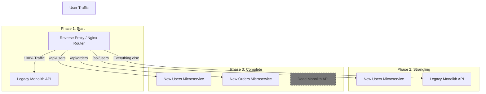

# Strangler Fig Pattern (Паттерн Фиговое Дерево / Удушитель)

Strangler Fig — это паттерн постепенной миграции унаследованной (legacy) системы на новую архитектуру. Название пошло от фигового дерева-удушителя, которое обвивает старое дерево, постепенно вырастает, забирает весь свет и питательные вещества, и в итоге старое дерево внутри умирает, оставляя только новую структуру.

Боль, которую мы решаем: "Переписывание с нуля" (Big Bang Rewrite). Если бизнес решает переписать огромный монолит или старый jQuery/AngularJS фронтенд с нуля на React, разработка новых фич останавливается на годы. В 90% случаев такие проекты проваливаются. Паттерн Strangler позволяет переписывать приложение по кусочкам, незаметно для пользователя.

### Как это работает на практике (на уровне API)
Вместо того чтобы клиенты обращались к старому бекенду напрямую, перед ним ставится API Gateway (роутер). Сначала роутер просто проксирует 100% запросов в старую систему. 
Затем команда пишет новый микросервис (например, `UserService`). На роутере меняется конфиг: все запросы на `/api/users` теперь идут в новый микросервис, а всё остальное — в легаси. Фронтенд (если контракты не поменялись) даже не знает, что под капотом что-то изменилось.

### Как это работает на практике (на уровне Фронтенда)
Паттерн применяется и к микрофронтендам.
1. У нас есть старый MPA (Multi-Page Application) на PHP/JSP.
2. Мы настраиваем Nginx так, что при переходе на `mysite.com/profile` отдается новый React SPA.
3. При клике на "Настройки" внутри SPA, пользователь переходит по обычной ссылке на `mysite.com/settings`, и Nginx отдает старую PHP-страницу.
4. Постепенно React SPA "съедает" всё больше роутов, пока от PHP не останется ничего.

### Неочевидные нюансы и трейдоффы
1. **Проблема общей сессии**: Если вы переносите роуты по одному (например, `/profile` на новый React, а `/checkout` на старый PHP), пользователю придется логиниться дважды! Вы должны настроить единую точку авторизации (SSO) или шарить куки между старым и новым приложением.
2. **Синхронизация UI**: Старое и новое приложения будут выглядеть по-разному (разные шрифты, кнопки, шапка). Разработчикам приходится тратить время на "мимикрию" — дублировать CSS легаси-системы в новом React-приложении (или наоборот), чтобы пользователь не чувствовал, что его кидает между двумя разными сайтами.
3. **Общие данные**: Если новый микросервис юзеров сохранил данные в свою новую PostgreSQL БД, как старый монолит (который всё еще работает с заказами) узнает об этом юзере? Придется настраивать репликацию баз данных или синхронизацию через брокеры сообщений (Kafka/RabbitMQ), что сильно усложняет инфраструктуру на время миграции.
