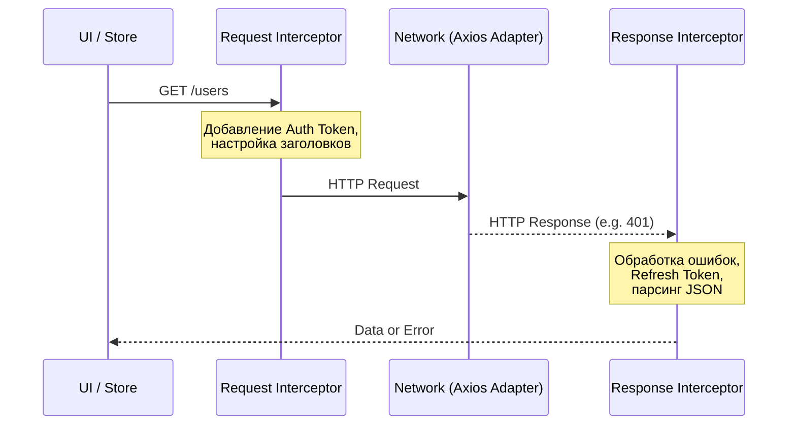

# Axios: Фундамент сетевого слоя

## Что это и какую боль решает

**Axios** — это популярный изоморфный (работающий и в браузере, и в Node.js) HTTP-клиент на основе Promise. 

Долгое время нативным способом делать запросы был громоздкий `XMLHttpRequest`. С появлением `fetch` ситуация улучшилась, но разработчики все равно сталкивались с рутиной:
- Необходимость вручную делать `response.json()` для каждого запроса.
- `fetch` не считает HTTP-статусы ошибок (например, 404 или 500) поводом для отклонения (reject) промиса. Ошибка возникает только при сбое сети.
- Сложность отмены запросов (до появления `AbortController`).
- Отсутствие встроенного механизма перехватчиков (interceptors) для добавления токенов или глобальной обработки ошибок.
- Сложность настройки таймаутов.

Axios решает эти проблемы «из коробки», предоставляя лаконичный API и мощную систему конфигурации, что делает его де-факто стандартом для построения сетевого слоя в сложных Frontend-приложениях.

## Как это работает на практике

Архитектурно сетевой слой на базе Axios строится вокруг **инстансов** (instances) и **перехватчиков** (interceptors). Вы создаете отдельный экземпляр клиента с базовым URL и таймаутами, а затем навешиваете на него middleware-подобные функции, которые могут трансформировать запрос до отправки и ответ до того, как он попадет в бизнес-логику.



## Примеры реализации

### ❌ Антипаттерн: Разрозненные запросы
Использование глобального объекта `axios` или дублирование логики в каждом запросе приводит к хрупкости кода.

```typescript
// Плохо: нет централизации, дублирование токена и урла
import axios from 'axios';

async function getUser() {
  const token = localStorage.getItem('token');
  const response = await axios.get('https://api.example.com/user', {
    headers: { Authorization: `Bearer ${token}` }
  });
  return response.data;
}
```

### ✅ Best Practice: Выделенный API клиент
Создание изолированного инстанса с интерцепторами. Это инкапсулирует логику сети.

```typescript
import axios from 'axios';

// 1. Создание инстанса
export const apiClient = axios.create({
  baseURL: process.env.VITE_API_URL,
  timeout: 10000,
  headers: {
    'Content-Type': 'application/json',
  },
});

// 2. Перехватчик запросов (например, для авторизации)
apiClient.interceptors.request.use((config) => {
  const token = localStorage.getItem('accessToken');
  if (token && config.headers) {
    config.headers.Authorization = `Bearer ${token}`;
  }
  return config;
}, (error) => Promise.reject(error));

// 3. Перехватчик ответов (глобальная обработка ошибок и рефреш токенов)
apiClient.interceptors.response.use(
  (response) => response.data, // Сразу возвращаем данные, отбрасывая метаинформацию
  async (error) => {
    const originalRequest = error.config;
    
    // Логика refresh token для 401 ошибки
    if (error.response?.status === 401 && !originalRequest._retry) {
      originalRequest._retry = true;
      try {
        const newToken = await refreshToken();
        localStorage.setItem('accessToken', newToken);
        originalRequest.headers.Authorization = `Bearer ${newToken}`;
        return apiClient(originalRequest); // Повторяем запрос
      } catch (refreshError) {
        // Логика разлогина
        window.location.href = '/login';
      }
    }
    
    // Централизованный маппинг ошибок для UI
    return Promise.reject(new ApiError(error.response?.data?.message));
  }
);
```

## Неочевидные нюансы и границы применимости

### Скрытые компромиссы и оверхед
- **Размер бандла:** Axios весит около ~11-15 KB (minified + gzipped). Для небольших виджетов или лендингов, где важен каждый килобайт, это может быть неоправданной роскошью.
- **Абстракция над абстракцией:** Под капотом в браузере Axios использует `XMLHttpRequest` (до версии 1.2.0) или `fetch` (с версии 1.2.0 появилась поддержка адаптера fetch). Иногда эта абстракция скрывает специфичные для платформы возможности.

### Когда это НЕ нужно использовать
1. **Современные Next.js / Remix приложения (Server Components):** В Next.js 13+ нативный `fetch` сильно расширен (добавлено кеширование `force-cache`, `revalidate`). Использование Axios в серверных компонентах ломает эти оптимизации, так как Axios не использует пропатченный Next-ом `fetch` по умолчанию. В таких фреймворках лучше писать обертку над нативным `fetch`.
2. **Service Workers:** Axios долгое время опирался на XHR, который недоступен в Service Workers. Хотя сейчас есть fetch-адаптер, нативный `fetch` там естественнее.
3. **Микро-виджеты:** Если ваше приложение делает два GET-запроса, нативный `fetch` + `response.ok` проверка будет проще и легче.

### Границы применимости
Axios сияет в **Enterprise SPA** (React, Vue, SPA-only), где:
- Множество API-ендпоинтов.
- Сложные флоу авторизации (Access/Refresh токены).
- Необходимость глобальной обработки ошибок (например, показ тостов о падении сети из одного места).
- Требуется отмена запросов (Axios предоставляет удобный `CancelToken` или работает с `AbortController`) и отслеживание прогресса загрузки файлов (`onUploadProgress`).
