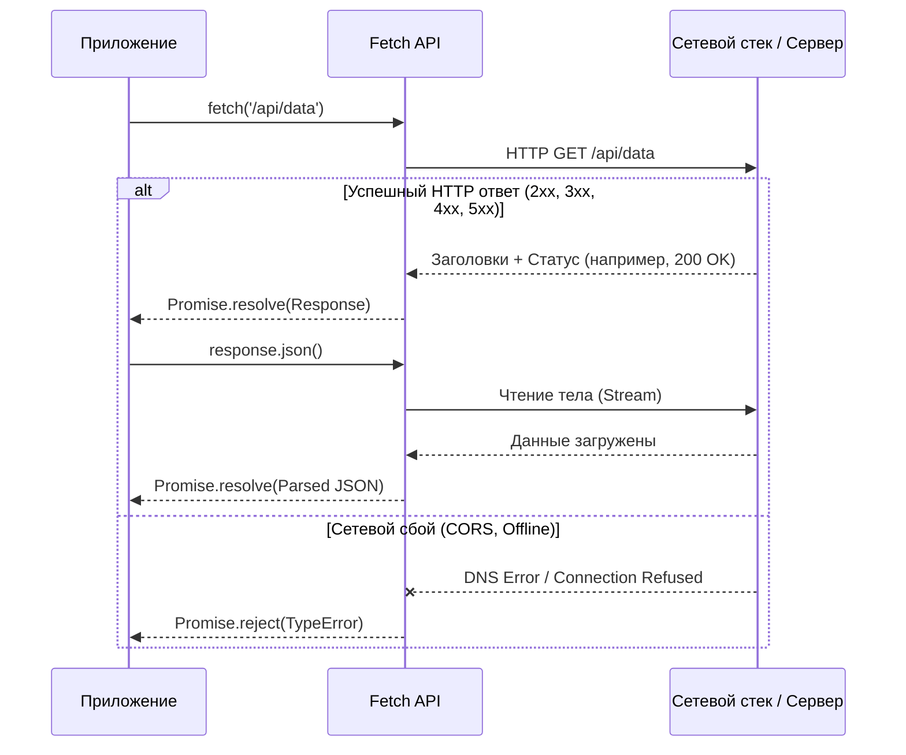

# Fetch API

## Что это такое
Fetch API — это современный браузерный интерфейс для выполнения сетевых запросов. Он предоставляет глобальный метод `fetch()`, который возвращает Promise, разрешающийся объектом `Response`. Fetch стандартизирует объекты `Request` и `Response`, делая их доступными не только для прямого вызова, но и для использования в других Web API (например, Service Workers или Cache API).

## Какую боль решает
До появления Fetch стандартом де-факто для асинхронных запросов был `XMLHttpRequest` (XHR). XHR страдал от ряда проблем:
- **Callback Hell:** Основан на событиях и функциях обратного вызова, что усложняло написание асинхронного, последовательного кода.
- **Запутанный API:** Конфигурация запроса, отправка и получение данных были разнесены по разным методам и свойствам объекта, смешивая входные и выходные данные в одном инстансе.
- **Сложная работа со стримами:** XHR загружал весь ответ в память.

Fetch принёс нативную поддержку промисов, потоки данных (Streams API) и строгий, декларативный синтаксис настройки запроса.

## Как это работает на практике
Fetch инициирует HTTP-запрос и немедленно возвращает промис. Главная архитектурная особенность: **Promise от `fetch` успешно разрешается (resolve) при любом ответе сервера**, даже если это ошибка 404 (Not Found) или 500 (Internal Server Error). Промис отклоняется (reject) только в случае сетевой ошибки (отсутствие подключения, ошибка DNS) или блокировки запроса (например, CORS).

### Архитектура выполнения запроса



## Где применять
- В подавляющем большинстве современных фронтенд-приложений для взаимодействия с REST API, GraphQL.
- В изоморфных приложениях (Next.js, Nuxt), так как Fetch теперь нативно поддерживается в Node.js (начиная с v18).
- При работе с Service Workers для перехвата запросов и реализации offline-first стратегий кеширования.
- Для потоковой обработки больших объемов данных через `ReadableStream`.

## Где ломается и неочевидные нюансы (Trade-offs)

### Отсутствие встроенного таймаута
В Fetch нет настройки вроде `timeout: 5000`. Если сервер "подвис" и не закрывает соединение, запрос будет висеть бесконечно (до лимита браузера). Решение — использовать `AbortController`, что добавляет существенный бойлерплейт к каждому запросу.

### Ручная обработка HTTP-статусов
Поскольку промис не падает при 500-х ошибках, разработчик обязан вручную проверять свойство `response.ok`. Забытая проверка приводит к падению приложения на этапе `response.json()`, так как сервер часто возвращает HTML-страницу с ошибкой вместо ожидаемого JSON.

### Отслеживание прогресса загрузки (Upload Progress)
В отличие от XHR, где есть событие `xhr.upload.onprogress`, Fetch **не поддерживает** отслеживание прогресса отправки данных на сервер (upload). Если вы делаете тяжелый загрузчик файлов с прогресс-баром, вам придется вернуться к `XMLHttpRequest` или использовать библиотеки вроде Axios (которые используют XHR под капотом в браузере). Отслеживание прогресса *скачивания* (download) возможно, но требует ручного чтения чанков через `response.body.getReader()`.

### Отмена запросов
Отмена запроса реализуется только через передачу сигнала от `AbortController`. Если архитектура не пробрасывает `signal` через все слои абстракции до самого `fetch`, отменить "застрявший" запрос при демонтировании компонента (unmount) будет невозможно, что приведет к утечкам памяти и race conditions.

## Примеры кода

### ❌ Анти-паттерн: "Слепой" парсинг
```javascript
// Ошибка: При 404 или 500 сервер вернет текст/html, 
// json() выбросит SyntaxError, маскируя реальную причину падения (статус).
async function getUser(id) {
    const response = await fetch(`/api/users/${id}`);
    return await response.json(); 
}
```

### ✅ Лучшая практика: Инфраструктурная обертка (Фасад)
На практике `fetch` редко используют напрямую в UI-компонентах. Его оборачивают в инфраструктурный сервис, который инкапсулирует логику таймаутов, проверки статусов и добавления общих заголовков (например, токенов авторизации).

```javascript
class NetworkError extends Error {
    constructor(status, message) {
        super(message);
        this.status = status;
    }
}

// Инфраструктурный слой для работы с API
async function apiFetch(endpoint, options = {}) {
    const { timeout = 8000, ...fetchOptions } = options;
    
    const controller = new AbortController();
    const timeoutId = setTimeout(() => controller.abort(), timeout);
    
    try {
        const response = await fetch(endpoint, {
            ...fetchOptions,
            headers: {
                'Content-Type': 'application/json',
                ...fetchOptions.headers
            },
            signal: controller.signal
        });
        
        clearTimeout(timeoutId);
        
        if (!response.ok) {
            // Централизованная обработка HTTP-ошибок
            throw new NetworkError(response.status, `HTTP Error: ${response.statusText}`);
        }
        
        // В зависимости от ответа парсим JSON или отдаем текст
        const contentType = response.headers.get("content-type");
        if (contentType && contentType.includes("application/json")) {
            return await response.json();
        }
        
        return await response.text();
    } catch (error) {
        if (error.name === 'AbortError') {
            throw new Error('Request timed out or was aborted');
        }
        // Перехват сетевых ошибок (offline, CORS)
        throw error;
    }
}
```
