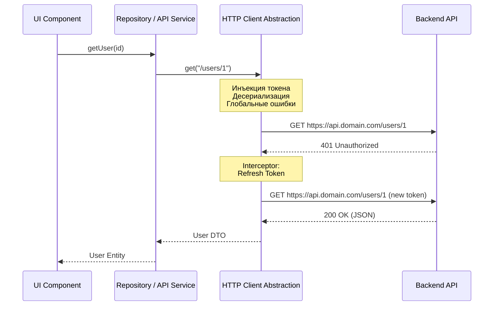

# Абстракция HTTP-клиента (HTTP Client Abstraction)

## Что это и какую боль решает?

В любом приложении, которое общается с сервером, сетевые запросы — это рутина. Если компоненты или бизнес-логика напрямую используют `fetch` или `axios`, кодовая база быстро превращается в хаос:
- **Дублирование:** В каждом из десятков запросов приходится вручную прописывать базовый URL, склеивать пути, добавлять заголовки (например, `Content-Type: application/json`).
- **Размытая безопасность:** Логика извлечения и подстановки токена авторизации (JWT) размазывается по всему приложению.
- **Хрупкость обработки ошибок:** Если бекенд меняет формат ответов с ошибками или логику рефреша токена при `401 Unauthorized`, разработчику придется вносить изменения в 50 разных местах.

**Абстракция HTTP-клиента** — это архитектурный паттерн, при котором все сетевые вызовы проходят через единый централизованный шлюз (модуль, класс или инстанс). Этот шлюз инкапсулирует транспортные детали, позволяя остальной части приложения запрашивать данные, ничего не зная о том, как именно формируются заголовки и парсится JSON.

## Как это работает на практике

На практике абстракция обычно реализуется через паттерн "Фасад" над `fetch` или инстанс библиотеки (вроде `axios`), настроенный с помощью перехватчиков (interceptors). 

Приложение делится на слои: UI вызывает Репозиторий (или API-сервис), а Репозиторий вызывает абстрактный `HTTP Client`.



### Примеры кода

**❌ Антипаттерн: Транспортная логика протекает в бизнес-слой или UI**
```typescript
// Компонент сам заботится о токене, парсинге JSON и склейке URL
async function fetchUserData(userId: string) {
  const token = localStorage.getItem('token');
  const response = await fetch(`https://api.domain.com/v1/users/${userId}`, {
    headers: {
      'Authorization': `Bearer ${token}`,
      'Content-Type': 'application/json'
    }
  });

  if (!response.ok) {
    if (response.status === 401) {
      // Ручная логика редиректа на логин
    }
    throw new Error('Network response was not ok');
  }
  
  return response.json();
}
```

**✅ Лучшая практика: Использование HTTP-клиента**
```typescript
// 1. Настройка инстанса (в одном месте)
export const apiClient = new HttpCore({
  baseURL: import.meta.env.VITE_API_URL,
});

apiClient.interceptors.request.use((config) => {
  const token = authService.getToken();
  if (token) config.headers.Authorization = `Bearer ${token}`;
  return config;
});

apiClient.interceptors.response.use(
  (response) => response.data,
  (error) => {
    if (error.status === 401) {
      authService.refreshToken();
    }
    return Promise.reject(new AppError(error));
  }
);

// 2. Использование в Репозитории/API-сервисе
export const userRepository = {
  getUser: (id: string): Promise<UserDTO> => apiClient.get(`/users/${id}`),
  updateUser: (id: string, data: Partial<UserDTO>) => apiClient.patch(`/users/${id}`, data)
};
```

## Где это применимо (и где нет)

**Строго необходимо:**
- В любых средних и крупных SPA (Single Page Applications).
- При наличии сложной системы аутентификации (refresh-токены, OAuth).
- Если требуется централизованный сбор метрик по запросам или глобальная обработка ошибок (например, показ "тостов" при `500 Internal Server Error`).

**Где не нужно (Overengineering):**
- Микро-приложения, лендинги с одной формой обратной связи.
- Интеграция со сторонним, экзотическим API, формат которого радикально отличается от вашего основного бекенда (в таком случае проще написать отдельный fetch-запрос или микро-клиент конкретно для этой интеграции).

## Неочевидные нюансы и трейд-оффы

- **Протекающие абстракции (Leaky Abstractions):** Если вы абстрагируете ответ так, что клиент возвращает только поле `data` из HTTP Response, вы теряете доступ к заголовкам (Headers) и статус-кодам. Это становится проблемой, когда бекенд передает метаданные пагинации через заголовок `X-Total-Count`, а ваш `apiClient` его "съел". *Решение: продумать формат возвращаемого объекта (например, `{ data, meta }`) или оставить возможность запрашивать сырой ответ (raw response).*
- **Заморозка нативного API:** `fetch` из коробки поддерживает `AbortController` (для отмены запросов) и `Streams API` (для потоковой обработки больших данных). Жесткая абстракция может скрыть эти возможности. Проектируя свой HTTP Client, убедитесь, что он может прокидывать `signal` и не ломается, если вместо JSON прилетает Blob (например, при скачивании PDF).
- **Слишком умный клиент (God Object):** Распространенная ошибка — зашивать в HTTP клиент логику бизнес-домена (например, парсинг специфичных ошибок валидации конкретной формы). Клиент должен отвечать только за транспортный протокол (HTTP), общую безопасность (токены) и сетевые ошибки. Трансформация DTO в сущности домена — задача слоя Репозитория.
